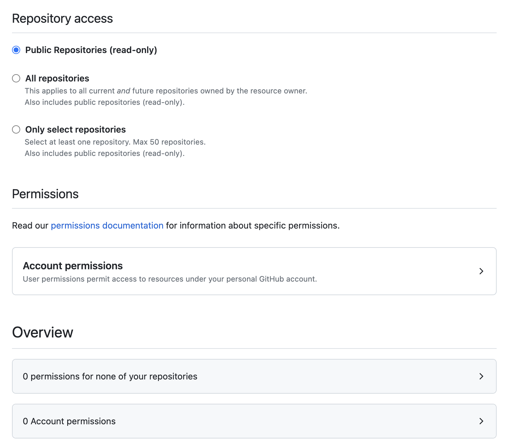

# Contribution Guide

## Welcome to the <!-- CYF-ONLY -->CYF<!-- END-CYF-ONLY --> Curriculum

We are a volunteer-led community of tech professionals, and we teach people to code for free. We are majority-minority, we welcome everyone, and we welcome _you_.

This curriculum compiles narratives and activities developed by hundreds of people all over the world. You are invited to join us. Volunteer for the Tech Education team to teach in our classes, or contribute in a number of other ways. You can also volunteer remotely.

[Volunteer with CYF](https://codeyourfuture.io/volunteers/)

## Who runs this?

Our Tech Education volunteers teach in our classes. All Tech Ed volunteers can, and do, develop content for the curriculum, and they are encouraged to experiment to see what works. Our trainees also notice problems, and propose or implement solutions!

The Curriculum Team is a group of long term volunteers who are responsible for the overall direction of the curriculum. They decide the strategy and accept new content into the core. Once a Tech Ed volunteer has sufficiently tried out their material, they can propose that it be adopted into the main curriculum, and the Curriculum Team will make the ultimate decision. See more info on contributing new content below.

The Curriculum is led by the Director of Education, currently [Daniel Wagner-Hall](https://github.com/illicitonion). We meet every two weeks to discuss the curriculum and make decisions. The agenda is posted in the Slack channel #cyf-curriculum and [the minutes](https://curriculum.codeyourfuture.io/guides/contributing/minutes/) are posted on this website. If you'd like to come and talk to us, please do!

## About our content

### Our content is:

- practical
- written in simple English at a maximum of CEFR B2
- free

### Our content is not:

- a textbook
- a reference manual
- a collection of tutorials

## Pedagogy

We broadly use the [Teach Tech Together](https://teachtogether.tech/) pedagogical framework, in a [flipped classroom](https://bokcenter.harvard.edu/flipped-classrooms) style.

## How to contribute

### Propose a new narrative or activity

We adopt _tested_ content into the main curriculum, so develop and try out your material first! Come to class, try it, and get feedback from the community. Come talk in #cyf-curriculum on Slack and iterate on your session.

1. Develop your narrative or activity in a repo. If you're running a workshop, develop in https://github.com/CodeYourFuture/CYF-Workshops. If it's a project, make a separate repo for it.
2. If you're recording a video, upload it to YouTube and make it public.
3. Use your material and iterate on it with trainees.
4. When you're ready to propose adoption, open a PR to this repo.
5. The Curriculum team will consider your proposal and give you feedback.

**We like to experiment.** If you have an idea, try it out and let us know how it goes! Keep your experiments small and test them early. (If you want to try something big, like a new module, come talk to us first.)

Our curriculum threads a coherent line through all of this activity, so whatever worlds we explore, we can all come back here and find out _what_ to do _next_.

_Most_ content we develop and use with classes will not be adopted into the core curriculum -- that's ok! We want to be free to experiment.

## Bugs

If you spot a bug, please let us know by [creating an issue]() or opening a PR with the fix. Bug fixes are super welcome!

As this front end composes many different repos, please open an issue in the repo where you found the bug. If you're not sure, open an issue in this [main repo]().

(If the content is pulled from another repo, there's a link next to the heading -- follow that link to the source repo and open an issue there.)

## Developing the source website

### To install

You need the following software packages to run this curriculum:
* `go`
* `hugo` (must be the extended version) - we recommend version 0.136 extended
* `npm`

On macOS:

```bash
brew install go hugo npm
```

### To run locally

#### Generate a token

You'll need to get a fine-grained GitHub API token which allows read-only access to all public CYF repos from [this page](https://github.com/settings/tokens?type=beta).

Click "Generate new token", enter a token name (can be anything), and how long you want the token to last (if you're doing a one-off contribution, pick a short value; if you're going to be a regular contributor, maybe a longer value).

Make sure the Resource owner is _your_ account if you have a choice.

The "Repository access" you need is "Public repositories (read-only)", and you don't need any account permissions:

<details>
<summary>Open to view screenshot of the required permissions</summary>



</details>

#### Set up `.env`

Copy the `/curriculum/.env.example` to `/curriculum/.env`. Edit the file and then change the line that says `HUGO_CURRICULUM_GITHUB_BEARER_TOKEN` to contain the token that you have generated earlier.

You can probably ignore the other entries.

#### Run this command

There are several websites in this repo - identify the one you want and make sure you're `cd`'d into that directory.

Run this command in a terminal:

```bash
npm i
npm run start:dev
```

If you find the build is very slow, and don't care about the issues being pulled into backlogs being precise, you can run:

```bash
npm run start:dev -- --environment issues-are-cached-and-incomplete
```

### Site Search

PageFind runs the search. https://pagefind.app/
It's in the build command on Netlify `hugo && npx pagefind --source "public"`
If you need to develop on this locally, run:

```zsh
rm -rf public &&
npm run build:dev &&
npx pagefind --site "public" --serve
```

And go to http://localhost:1414/ to see the PageFind-served site with search enabled; but there is no hot reload. You can run hugo on http://localhost:1313/ at the same time.

## Contributors ✨

Thanks goes to these wonderful people ([emoji key](https://allcontributors.org/docs/en/emoji-key)):

<!-- ALL-CONTRIBUTORS-LIST:START - Do not remove or modify this section -->
<!-- prettier-ignore-start -->
<!-- markdownlint-disable -->
<table>
  <tr>
    <td align="center"><a href="https://github.com/nbogie"><br /><sub><b>nbogie</b></sub></a><br /><a href="https://github.com/CodeYourFuture/syllabus/commits?author=nbogie" title="Documentation">📖</a></td>
    <td align="center"><a href="https://stephanie.chezleskrus.com/"><br /><sub><b>Stéphanie Krus</b></sub></a><br /><a href="#a11y-stephanie-K" title="Accessibility">️️️️♿️</a></td>
    <td align="center"><a href="http://www.thecodethatchriswrote.com"><br /><sub><b>Chris Owen</b></sub></a><br /><a href="https://github.com/CodeYourFuture/syllabus/commits?author=ChrisOwen101" title="Documentation">📖</a></td>
    <td align="center"><a href="https://github.com/mickyginger"><br /><sub><b>Mike Hayden</b></sub></a><br /><a href="#content-mickyginger" title="Content">🖋</a></td>
    <td align="center"><a href="https://alasdairsmith.co.uk"><br /><sub><b>Alasdair Smith</b></sub></a><br /><a href="#content-40thieves" title="Content">🖋</a> <a href="https://github.com/CodeYourFuture/syllabus/commits?author=40thieves" title="Documentation">📖</a></td>
    <td align="center"><a href="https://github.com/textbook/about"><br /><sub><b>Jonathan Sharpe</b></sub></a><br /><a href="#content-textbook" title="Content">🖋</a> <a href="#infra-textbook" title="Infrastructure (Hosting, Build-Tools, etc)">🚇</a></td>
    <td align="center"><a href="https://github.com/RC-PM"><br /><sub><b>rc-pm</b></sub></a><br /><a href="https://github.com/CodeYourFuture/syllabus/commits?author=rc-pm" title="Documentation">📖</a></td>
  </tr>
  <tr>
    <td align="center"><a href="https://github.com/nholdsworth94"><br /><sub><b>Nick Holdsworth</b></sub></a><br /><a href="#content-nholdsworth94" title="Content">🖋</a></td>
    <td align="center"><a href="https://github.com/timhamrouge"><br /><sub><b>Tim Hamrouge</b></sub></a><br /><a href="#content-timhamrouge" title="Content">🖋</a></td>
    <td align="center"><a href="https://github.com/Dedekind561"><br /><sub><b>MitchLloyd</b></sub></a><br /><a href="https://github.com/CodeYourFuture/syllabus/pulls?q=is%3Apr+reviewed-by%3ADedekind561" title="Reviewed Pull Requests">👀</a> <a href="https://github.com/CodeYourFuture/syllabus/commits?author=Dedekind561" title="Tests">⚠️</a> <a href="https://github.com/CodeYourFuture/syllabus/commits?author=Dedekind561" title="Code">💻</a></td>
    <td align="center"><a href="https://github.com/gregdyke"><br /><sub><b>gregdyke</b></sub></a><br /><a href="#infra-gregdyke" title="Infrastructure (Hosting, Build-Tools, etc)">🚇</a> <a href="https://github.com/CodeYourFuture/syllabus/commits?author=gregdyke" title="Tests">⚠️</a> <a href="#content-gregdyke" title="Content">🖋</a> <a href="https://github.com/CodeYourFuture/syllabus/commits?author=gregdyke" title="Code">💻</a></td>
    <td align="center"><a href="http://lucymac.github.io/"><br /><sub><b>Lucy Zidour</b></sub></a><br /><a href="#content-LucyMac" title="Content">🖋</a> <a href="https://github.com/CodeYourFuture/syllabus/commits?author=LucyMac" title="Code">💻</a> <a href="https://github.com/CodeYourFuture/syllabus/pulls?q=is%3Apr+reviewed-by%3ALucyMac" title="Reviewed Pull Requests">👀</a></td>
    <td align="center"><a href="https://github.com/theseafaringturtle"><br /><sub><b>Alessandro</b></sub></a><br /><a href="#content-theseafaringturtle" title="Content">🖋</a> <a href="https://github.com/CodeYourFuture/syllabus/commits?author=theseafaringturtle" title="Code">💻</a></td>
    <td align="center"><a href="https://github.com/makanti"><br /><sub><b>Antigoni Makri</b></sub></a><br /><a href="#content-makanti" title="Content">🖋</a> <a href="https://github.com/CodeYourFuture/syllabus/commits?author=makanti" title="Code">💻</a></td>
      </tr>
  <tr>
    <td align="center"><a href="https://francescrosas.com"><br /><sub><b>Francesc Rosas</b></sub></a><br /><a href="#content-frosas" title="Content">🖋</a></td>
    <td align="center"><a href="http://sammart.in"><br /><sub><b>Sam Martin</b></sub></a><br /><a href="#content-Sam-Martin" title="Content">🖋</a> <a href="https://github.com/CodeYourFuture/syllabus/commits?author=Sam-Martin" title="Code">💻</a></td>
    <td align="center"><a href="https://github.com/jcholyhead"><br /><sub><b>jcholyhead</b></sub></a><br /><a href="#content-jcholyhead" title="Content">🖋</a> <a href="https://github.com/CodeYourFuture/syllabus/commits?author=jcholyhead" title="Code">💻</a></td>
    <td align="center"><a href="https://github.com/MarkFarmiloe"><br /><sub><b>Mark Farmiloe</b></sub></a><br /><a href="#content-MarkFarmiloe" title="Content">🖋</a> <a href="https://github.com/CodeYourFuture/syllabus/commits?author=MarkFarmiloe" title="Code">💻</a></td>
    <td align="center"><a href="https://github.com/szemate"><br /><sub><b>Máté Szendrő</b></sub></a><br /><a href="#content-szemate" title="Content">🖋</a> <a href="https://github.com/CodeYourFuture/syllabus/commits?author=szemate" title="Code">💻</a></td>
    <td align="center"><a href="https://github.com/mcrav"><br /><sub><b>Matthew Craven</b></sub></a><br /><a href="https://github.com/CodeYourFuture/syllabus/issues?q=author%3Amcrav" title="Bug reports">🐛</a></td>
    <td align="center"><a href="https://github.com/carterd888"><br /><sub><b>Daniel Carter</b></sub></a><br /><a href="https://github.com/CodeYourFuture/syllabus/issues?q=author%3Acarterd888" title="Bug reports">🐛</a></td>
      </tr>
  <tr>
    <td align="center"><a href="https://github.com/bonboh"><br /><sub><b>Coung</b></sub></a><br /><a href="#content-bonboh" title="Content">🖋</a> <a href="https://github.com/CodeYourFuture/syllabus/commits?author=bonboh" title="Code">💻</a></td>
    <td align="center"><a href="https://github.com/Lana-Franks-Code"><br /><sub><b>Lana-Franks-Code</b></sub></a><br /><a href="https://github.com/CodeYourFuture/syllabus/issues?q=author%3ALana-Franks-Code" title="Bug reports">🐛</a></td>
    <td align="center"><a href="https://github.com/g1st"><br /><sub><b>Gintaras</b></sub></a><br /><a href="https://github.com/CodeYourFuture/syllabus/issues?q=author%3Ag1st" title="Bug reports">🐛</a></td>
    <td align="center"><a href="https://github.com/rickscode"><br /><sub><b>rickscode</b></sub></a><br /><a href="https://github.com/CodeYourFuture/syllabus/issues?q=author%3Arickscode" title="Bug reports">🐛</a></td>
    <td align="center"><a href="https://github.com/ClaireBickley"><br /><sub><b>Claire Bickley</b></sub></a><br /><a href="#content-ClaireBickley" title="Content">🖋</a></td>
    <td align="center"><a href="http://www.jackfranklin.co.uk"><br /><sub><b>Jack Franklin</b></sub></a><br /><a href="https://github.com/CodeYourFuture/syllabus/issues?q=author%3Ajackfranklin" title="Bug reports">🐛</a></td>
    <td align="center"><a href="https://github.com/sansaid"><br /><sub><b>Sanyia Saidova</b></sub></a><br /><a href="#content-sansaid" title="Content">🖋</a> <a href="https://github.com/CodeYourFuture/syllabus/commits?author=sansaid" title="Code">💻</a></td>
      </tr>
  <tr>
    <td align="center"><a href="https://github.com/ochthenoodle"><br /><sub><b>Jo</b></sub></a><br /><a href="#content-ochthenoodle" title="Content">🖋</a> <a href="https://github.com/CodeYourFuture/syllabus/commits?author=ochthenoodle" title="Code">💻</a></td>
  </tr>
</table>

<!-- markdownlint-restore -->
<!-- prettier-ignore-end -->

<!-- ALL-CONTRIBUTORS-LIST:END -->

This project follows the [all-contributors](https://github.com/all-contributors/all-contributors) specification. Contributions of any kind welcome!
