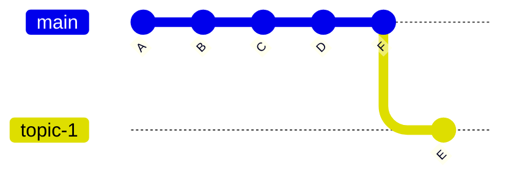
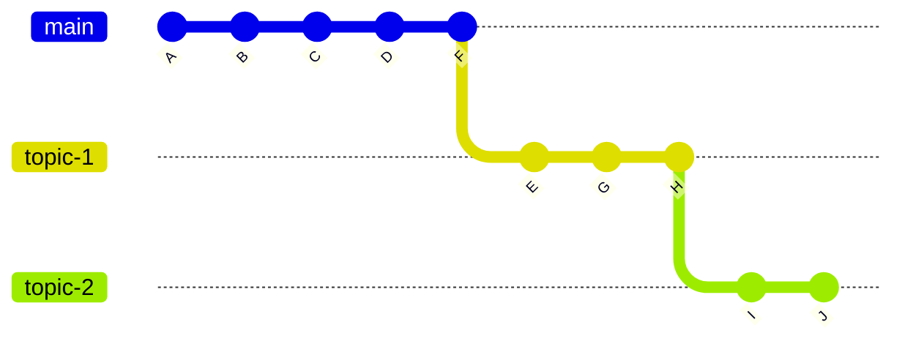

+++
title = 'Git Branching Workshop'
time = 60
[tasks]
    1='Explain the difference between local branches and remote branches'
    2='Create a new branch for a new piece of coursework'
    3='Submit a PR that contains only the commits for that piece of work'
    4='Identify when a PR contains commits from the wrong branch'
[objectives]
    1='Create a branch from main and keep it separate from other work'
    2='Submit a clean PR with only the relevant commits'
    3='Diagnose a mixed-commit PR and fix it'
[build]
  render = 'never'
  list = 'local'
  publishResources = false
+++

This workshop addresses a problem we see regularly: trainees submit PRs that contain commits from other pieces of coursework. This happens because of a misconception about how branches work. This workshop builds the right mental model.

Before this workshop, make sure you have completed [Using GitHub](../using-github) and read the [Trainee PR Guide](../../guides/reviewing/trainee-pr-guide).

Also look at the [branching notes in the Onboarding module](https://curriculum.codeyourfuture.io/itp/onboarding/sprints/1/prep/#branching) for a visual guide to creating branches.

## The Core Problem

When you submit coursework, each piece should come from its own branch. If you make two pieces of coursework on the same branch, your PR for coursework B will also contain all the commits from coursework A. This makes it impossible to review and merge them separately.

This workshop will show you:
1. Why this happens
2. How to prevent it
3. How to diagnose it if it goes wrong

---

## Part 1: Understanding Branches Visually (15 minutes)

### Exercise: Map the Branch Structure

Look at these two diagrams of a repository.

**Diagram 1: Clean branch structure**



**Diagram 2: Problem - topic-2 was branched from topic-1, not main**



**Task:** In your own words, answer these questions:

1. In Diagram 1, which commits belong to topic-1?
2. In Diagram 2, what went wrong with topic-2?
3. If you submitted a PR for topic-2 from Diagram 2, what would it contain?
4. What should topic-2 have been branched from?

Share your answers with your group.

---

## Part 2: Create Two Branches Correctly (25 minutes)

### Exercise: Two Coursework Pieces, Two Branches

Your trainer will share a link to a practice repository. For this exercise, you will complete two separate pieces of coursework on two separate branches.

**Important:** Each branch must be created from `main`, not from the other branch.

These steps use the terminal. If you prefer, you can do this in VSCode using the Source Control panel instead -- the concepts are the same, only the interface is different.

**Step 1: Branch for Coursework 1**

- Clone the repository
- Create a new branch from `main` called `cw1`
- Make a change (edit any file), commit it
- Push `cw1` to your fork

**Step 2: Verify your branch is clean**

Before you make any more commits, check what commits are on your branch. In your terminal, run:

```bash
git log main..HEAD
```

This shows commits on your branch that are not on main. If it shows more than the commits you just made, something is wrong.

**Step 3: Create Branch for Coursework 2**

Now create a second branch, also from `main`. In your terminal:

```bash
git checkout main
git pull origin main
git checkout -b cw2
```

Make a different change, commit it, push `cw2`.

**Step 4: Verify cw2 is separate**

Check the log for cw2. In your terminal:

```bash
git log main..HEAD
```

How many commits does it show? They should only be the one you just made.

**What went wrong in the bad example:** The trainee created `cw2` from `cw1` instead of from `main`. This means `cw2` contains all of `cw1`'s commits as well.

---

## Part 3: Diagnosing a Mixed-Commit PR (20 minutes)

### Exercise: Find the Problem

Your trainer will share a link to a PR that has a problem. This PR contains commits that should not be there.

Use the GitHub interface to answer these questions:

1. How many commits does this PR contain?
2. Look at the commit list. Are there any commits that do not belong to this piece of work?
3. Can you identify which branch these extra commits came from?
4. How would you fix this?

**Hints:**

- Click on the commits tab to see the full list
- Click on individual commits to see what changed
- Look for commits with messages that do not match the coursework description

### Discussion (5 minutes)

As a group, discuss:

- What was the problem in this PR?
- How would you avoid making the same mistake?
- What command would you run locally to check your PR before submitting?

---

## Key Takeaways

- **Every piece of coursework gets its own branch, branched from `main`**
- If you need to start new coursework while waiting for a review, always branch from `main`, not from your current work
- `git log main..HEAD` tells you exactly what commits are on your branch and not on `main`
- Before submitting a PR, check the commits tab. Does every commit belong to this piece of work?
- If your PR has extra commits, the fix is: create a new branch from `main`, cherry-pick only the right commits, submit a new PR