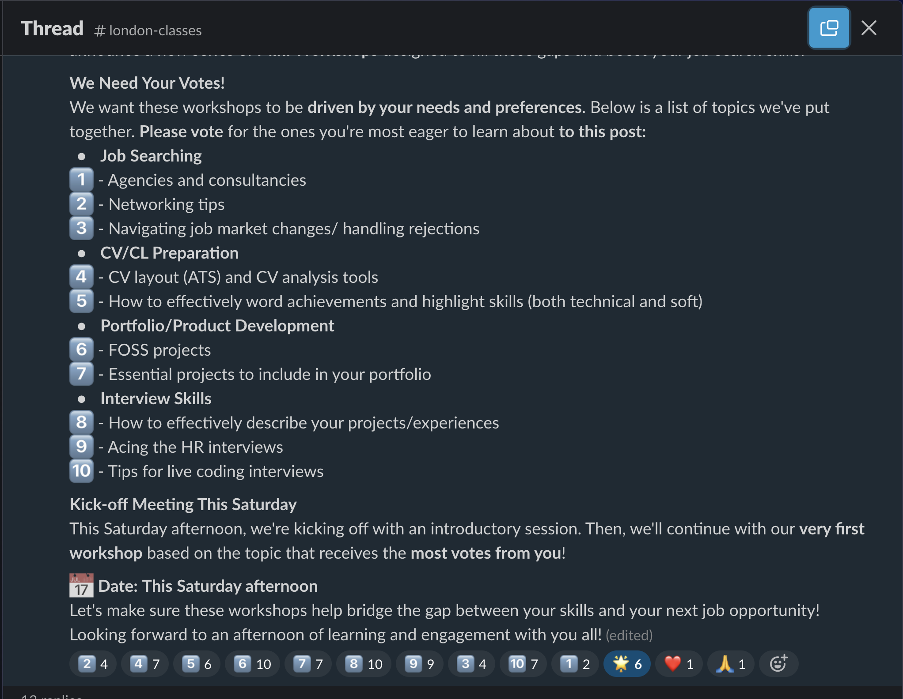

+++
title = 'Workshop Activity'
headless = true
time = 120
emoji= '🧰'
[objectives]
    1='Apply concepts from study to a practical example'
    2='Work together on exercises and activities to find gaps in understanding'
    3='Describe and resolve mental model errors'
+++

This space is for a workshop activity of your choosing. In order for this to actually happen, you must organise it ahead of time.

### No lectures

[Code Your Future workshops ](https://workshops.codeyourfuture.io/)are designed to be interactive. Developed by volunteers and trainees, they are not about listening to a lecture. They are about doing, discussing, and learning together.

### No spoonfeeding

Workshops are also not tutorials, where you follow along step-by-step. [CYF workshops](https://workshops.codeyourfuture.io/) are meant to _expose gaps and mistakes_ in your understanding, so mentors can help you fix them. This means you should expect to be challenged and to make mistakes. This is the main value of mentor-led workshops.

### Responding to needs

You can run a workshop in person on class days, or online in the week. Mentors volunteer to run workshops on Slack, and learners propose topics they need help with. There are a huge number of workshops available at [workshops.codeyourfuture.io/](https://workshops.codeyourfuture.io/).

