```mermaid
xychart-beta
title "O(n²) Quadratic Time"
x-axis "Input Size" [10, 20, 30, 40, 50, 60, 70, 80, 90, 100]
y-axis "Computation Time" 0 --> 10000
line [100, 400, 900, 1600, 2500, 3600, 4900, 6400, 8100, 10000]
```

```mermaid
xychart-beta
title "O(2ⁿ) Exponential Time"
x-axis [1, 2, 3, 4, 5, 6, 7, 8, 9, 10]
y-axis "Computation Time" 0 --> 1024
line [2, 4, 8, 16, 32, 64, 128, 256, 512, 1024]
```

+++
title = "Big-O"
time = 30
[build]
  render = 'never'
  list = 'local'
  publishResources = false
[objectives]
    1="Categorise algorithms as O(lg(n)), O(n), O(n^2), O(2^n)"
+++

> [Big-O](https://en.wikipedia.org/wiki/Big_O_notation) notation describes how **resource use** grows as the **input** size (n) **grows**.




Complete the coursework [Data Structures and Algorithms: Space and Time Complexity](https://www.wscubetech.com/resources/dsa/time-complexity).

This is in your backlog. You do not need to do it right now, but it might help to. If not, you might like to open it in a tab.



<details><summary>

😀 **Constant:** The algorithm takes the same amount of time, regardless of the input size.

</summary>

```mermaid

xychart-beta
title "O(1) Constant Time"
x-axis "Input Size" [1, 2, 3, 4, 5, 6, 7, 8, 9, 10]
y-axis "Computation Time" 0 --> 10
line [1, 1, 1, 1, 1, 1, 1, 1, 1, 1]
```

An example is getting the first character of a string. No matter how long the string is, we know where the first character is, and we can get it.

</details>

<details>


<summary>

☺️ **Logarithmic:** The runtime grows proportionally to the [logarithm](https://www.bbc.co.uk/bitesize/guides/zn3ty9q/revision/1) of the input size.</summary>

An example is finding a string in a sorted list. Each time we can look in the middle of the list, and halve the number of entries we need to consider next time by looking either in the half before or the half after that element.
</details>

<details>

```mermaid
xychart-beta
title "O(n) Linear Time"
x-axis "Input Size" [1, 2, 3, 4, 5, 6, 7, 8, 9, 10]
y-axis "Computation Time" 0 --> 10
line [1, 2, 3, 4, 5, 6, 7, 8, 9, 10]
```

<summary>

🙂 **Linear:** The runtime grows proportionally to the input size.</summary>

An example is finding an element by value in an un-sorted list. To be sure we find the element, we may need to look through every element in the list and check if it's the one we're looking for.

If we double the length of the list, we need to check twice as many elements.

</details>

<details>



<--->

| input | time |
| ----- | ---- |
| 1     | 1    |
| 2     | 4    |
| ...   | ...  |
| 7     | 49   |
| 8     | 64   |
| 9     | 81   |
| 10    | 100  |



What does this mean? It means that the time is the square of the input size: n\*n.

An example is finding which elements in an array are present more than once. For each element, we need to check every other element in the same array to see if they're equal. If we double the number of elements in the array, we _quadruple_ the number of checks we need to do.

<summary>

😨 **Quadratic:** The runtime grows proportionally to the square of the input size.</summary>

</details>

<details>




<--->

| input | time |
| ----- | ---- |
| 1     | 2    |
| 2     | 4    |
| 3     | 8    |
| 4     | 16   |
| ...   | ...  |
| 9     | 512  |
| 10    | 1024 |


Oh where have we seen this sequence of numbers before? ;)

<summary>

😱 **Exponential:** The runtime grows exponentially with the input size.</summary>

An example is making a list of every _combination_ of ever element in a list (so if we have `[1, 2, 3]` and want to make all the combinations: `[]`, `[1]`, `[2]`, `[3]`, `[1, 2]`, `[1, 3]`, `[2, 3]`, `[1, 2, 3]`).

</details>

You will explore this theory in your backlog, but you will find that you already have a basic understanding of this idea. No really! Let's look at these algorithms in real life:


[LABEL=Constant Time]

- Finding your own parked car in your designated spot. Doesn't matter if the car park has 10 spots or 1000, finding your spot takes the same time. This is like accessing an index in an array.

  [LABEL=Logarithmic Time]

- Finding a name in a physical dictionary or **sorted** phone book. You open to the middle, decide which half the name is in, and repeat. Each step halves the problem. Adding way more pages doesn't increase the search time proportionally. This is like [binary search](logic/sprints/1/prep#bisection).

  [LABEL=Linear Time]

- Reading every page of a book in order to find a specific word. If the book doubles in length, it takes roughly double the time. This is like looping over an array.
  [LABEL=Quadratic Time]
- Everyone at a party shaking hands with everyone else. If you double the number of people (n), the number of handshakes increases much faster (roughly n \* n). This is like nesting a loop inside a loop.
  [LABEL=Exponential Time]
- Trying every possible combination to unlock a password. Each extra character dramatically increases the possibilities.
  

> [!TIP]
>  Big-O notation also describes space complexity (how memory use grows). Sometimes an algorithm's time complexity is different from its space complexity. We have focused on time here, but you'll meet space complexity analysis in the assigned reading. 

Big-O notation is focused on the _trend_ of growth, not the exact growth.

Think about strings: one character may take up one byte or four. If we double the length of the string, we don't check which characters are in the string. We just think about the **trend**. The string will take _about_ twice as much space. If the string only has four-byte characters, and we add one-byte characters, the string is _still_ growing linearly, even though it may not take _exactly_ double the space.
