```mermaid
xychart-beta
title "O(n²) Quadratic Time"
x-axis "Input Size" [10, 20, 30, 40, 50, 60, 70, 80, 90, 100]
y-axis "Computation Time" 0 --> 10000
line [100, 400, 900, 1600, 2500, 3600, 4900, 6400, 8100, 10000]
```

```mermaid
xychart-beta
title "O(2ⁿ) Exponential Time"
x-axis [1, 2, 3, 4, 5, 6, 7, 8, 9, 10]
y-axis "Computation Time" 0 --> 1024
line [2, 4, 8, 16, 32, 64, 128, 256, 512, 1024]
```

+++
title = "Big-O"
headless = true
time = 30
emoji= "📈"
[objectives]
    1="Categorise algorithms as O(lg(n)), O(n), O(n^2), O(2^n)"
    2="Give practical limits to the size of inputs to O(n^2) and O(2^n) algorithms"
+++

> [Big-O](https://en.wikipedia.org/wiki/Big_O_notation) notation describes how **runtimes** grow as the **input** size (n) **grows**.




Complete the coursework [Data Structures and Algorithms: Space and Time Complexity](https://www.wscubetech.com/resources/dsa/time-complexity).

This is in your backlog and you do not need to do it now, but you might like to open it in a tab.



<details><summary>

☺️ **Constant:** The algorithm takes the same amount of time, regardless of the input size.

</summary>

```mermaid

xychart-beta
title "O(1) Constant Time"
x-axis "Input Size" [1, 2, 3, 4, 5, 6, 7, 8, 9, 10]
y-axis "Computation Time" 0 --> 10
line [1, 1, 1, 1, 1, 1, 1, 1, 1, 1]
```

</details>

<details>


<summary>

😟 **Logarithmic:** The runtime grows proportionally to the [logarithm](https://www.bbc.co.uk/bitesize/guides/zn3ty9q/revision/1) of the input size.</summary>

</details>

<details>

```mermaid
xychart-beta
title "O(n) Linear Time"
x-axis "Input Size" [1, 2, 3, 4, 5, 6, 7, 8, 9, 10]
y-axis "Computation Time" 0 --> 10
line [1, 2, 3, 4, 5, 6, 7, 8, 9, 10]
```

<summary>

😨 **Linear:** The runtime grows proportionally to the input size.</summary>

</details>

<details>



<--->

| input | time |
| ----- | ---- |
| 1     | 1    |
| 2     | 4    |
| ...   | ...  |
| 7     | 49   |
| 8     | 64   |
| 9     | 81   |
| 10    | 100  |



What does this mean? It means that the time is the square of the input size: n\*n.

<summary>

😰 **Quadratic:** The runtime grows proportionally to the square of the input size.</summary>

</details>

<details>




<--->

| input | time |
| ----- | ---- |
| 1     | 2    |
| 2     | 4    |
| 3     | 8    |
| 4     | 16   |
| ...   | ...  |
| 9     | 512  |
| 10    | 1024 |


Oh where have we seen this sequence of numbers before? ;)

<summary>

😱 **Exponential:** The runtime grows exponentially with the input size.</summary>

</details>

You will find that you already have a basic understanding of this idea. No really! Let's look at these algorithms in real life:


[LABEL=Constant Time]

- Finding your own parked car in your designated spot. Doesn't matter if the car park has 10 spots or 1000, finding your spot takes the same time.
  [LABEL=Logarithmic Time]
- Finding a name in a physical dictionary or **sorted** phone book. You open to the middle, decide which half the name is in, and repeat. Each step halves the problem. Adding way more pages doesn't increase the search time proportionally.
  [LABEL=Linear Time]
- Reading every page of a book in order to find a specific word. If the book doubles in length, it takes roughly double the time.
  [LABEL=Quadratic Time]
- Everyone at a party shaking hands with everyone else. If you double the number of people (n), the number of handshakes increases much faster (roughly n \* n).
  [LABEL=Exponential Time]
- Trying every possible combination to unlock a password. Each extra character dramatically increases the possibilities.
  

You will explore this theory in your backlog. Let's look at some practical examples.
