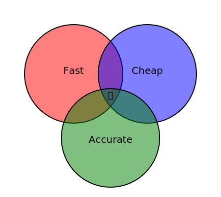

+++
title = "Cache Invalidation"
time = 15
[build]
  render = 'never'
  list = 'local'
  publishResources = false
[objectives]
    1="Identify and explain staleness risks with caching, and the difficulty of invalidation"
+++

> "There are only two hard things in Computer Science: cache invalidation and naming things." ~ Phil Karlton

### 🍣 Stale/Fresh

What happens if the answer changes after we have cached it? The user might see an old version. This is called a stale cache or staleness. We need to tell the cache: "This item is old, get a fresh copy" . This is 
[Cache invalidation](https://redis.io/glossary/cache-invalidation/) is the process of removing data that is no longer accurate or useful., and [it's tricky.](https://shouldiblamecaching.com/)

In the browser, common invalidation strategies include:

- **[Time-To-Live](https://developer.mozilla.org/en-US/docs/Glossary/TTL)** (TTL): Items expire after a set time (e.g., "cache this image for 1 hour"). 
- **[ETags/Last-Modified Headers](https://developer.mozilla.org/en-US/docs/Web/HTTP/Reference/Headers/Last-Modified)**: The browser asks the server "I have version X, is it still current?". If yes, the server sends back a "304 Not Modified" response; if no, it sends the new version. A server can send a 304 response faster than it can send the whole content. But having to make a network request and wait for the answer is slower than not making a network request.
- **Cache-Busting**: Change the name when the content changes. The browser sees a new URL and must download it. Inspect this web page and look at the CSS link in the header. The file is automatically [fingerprinted](https://gohugo.io/hugo-pipes/fingerprint/) to bust the cache when the fingerprint changes.

### 🤔 Why Is This Hard?

If there are so many solutions, why do we say cache invalidation is hard? It's because every cache is a tradeoff between running out of time, running out of resources, and giving the right answer. Your program can be fast and cheap, but probably not accurate. It can be fast and accurate, but that's not cheap. And it can be cheap and accurate, but that's not likely to be fast. 

When we do not cache, our program is _slow_. If we do not invalidate our cache at the right moment, our program is **wrong**. 

In different applications, there are different priorities:
* In a social media application, it's probably more important to be fast than correct. If our goal is to serve the user the most interesting post to them, but we more quickly serve them the second most interesting post to them, the user will probably still be pretty happy (and maybe it gives us time to load the other post to show them next).
* In an application handling medical records, it's probably more important to be correct than fast. If a doctor is checking whether a patient is allergic to a medication they're about to give them, a fast but wrong answer could be fatal.

Software has real effects in the world. It's important to think about the real-world context and implications of our software when we're writing it.
