+++
title = "Memory consumption"
description="Memory is finite"
time = 30
[build]
  render = 'never'
  list = 'local'
  publishResources = false
[objectives]
    1="Quantify the memory used by different arrays"
+++

> 📏 There are only so many bits you can fit on a chip.

Computers are real things, not diagrams or mathematical models. This means a computer has a limited physical size and a finite amount of memory. When your program runs, it uses some of this memory to store data.

```mermaid
graph LR
CPU -->|️ Fastest and Smallest| Cache -->|Fast and Small| RAM -->|Slow and Big| Disk -->|Slowest and Vast| Network
```

Think back to Chapter 7 of <cite>How Your Computer Really Works</cite>.



At each stage there are **limits** to **how fast** you can get the data and **how much** data you can store. Given this constraint, we need to consider how much memory our programs consume.

### 🧘🏽 Simpler is smaller

Consider these data structures. Order them from least to most memory needed:

```js
const userIds = [101, 102, ..., 1100]; // An array of 1000 numbers
const userRoles = ["Admin", "Editor", "Viewer"]; //An array of 3 short strings
const userProfiles = [ {id: 1, name: "Farzaneh", role: "Admin", preferences: {...}}, {id: 2, name: "Cuneyt", role: "Editor", preferences: {...}} ]; // An array of 2 complex objects
```

Different kinds of data have different memory footprints. All data is fundamentally stored as bytes. We can form intuition for how much memory a piece of data takes:

- Numbers are typically stored as 8 bytes. In some languages, you can define numbers which take up less space (but can store a smaller range of values).
- Each character in an ASCII string takes 1 byte. More complex characters may take more bytes. The biggest characters take up to 4 bytes.
- The longer a string, the more bytes it consumes.
- Objects and arrays are stored in different ways in different languages. But they need to store _at least_ the information contained within them.
  - This means an array of 5 elements will use _at least_ as much memory as the 5 elements would on their own.
  - And objects will use _at least_ as much memory as all of the _values_ inside the object (and in some languages, all of the keys as well).

More complicated elements or more properties need more memory. It matters what things are made of. All of this data added up is how much _space_ our program takes.

It also matters how many _steps_ our program takes. Another way to think of this is how much _time_ it takes to get the answer...
