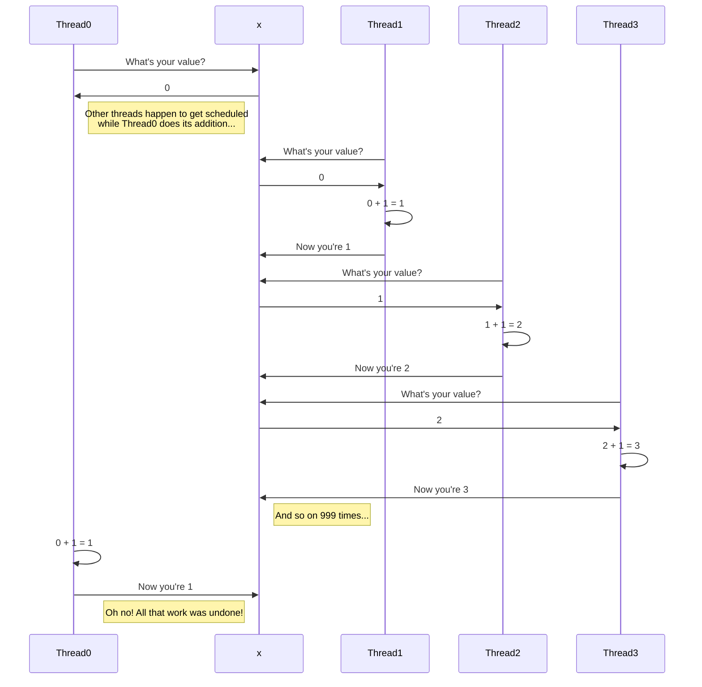

+++
title = "Single-variable Concurrency"
time = 120
objectives = [
  "Identify thread safety issues when updating a single variable.",
  "Explain how `+=` operations can cause bad writes in the presence of threads.",
  "Describe (at a high level) three approaches to fixing single-variable thread-safety issues.",
]
[build]
  render = "never"
  list = "local"
  publishResources = false
+++

Let's look at the example buggy code (taken from the Mutexes chapter of golangbot - there are tabs with the same code in different languages):


===[[Go]]===

```go
package main

import (
	"fmt"
	"sync"
)

var x = 0

func increment(wg *sync.WaitGroup) {
	x = x + 1
	wg.Done()
}

func main() {
	var w sync.WaitGroup
	for i := 0; i < 1000; i++ {
		w.Add(1)
		go increment(&w)
	}
	w.Wait()
	fmt.Println("final value of x", x)
}
```

===[[Java]]===

```java
import java.util.ArrayList;
import java.util.List;
import java.util.concurrent.ExecutorService;
import java.util.concurrent.Executors;
import java.util.concurrent.Future;

class Main {
  static final class IntegerHolder {
    public int value = 0;
  }

  public static void main(String[] args) throws Exception {
    final IntegerHolder holder = new IntegerHolder();

    List<Future<?>> futures = new ArrayList<>();

    // Make a threadpool of 100 threads.
    ExecutorService executorService = Executors.newFixedThreadPool(100);

    // Submit 10000 tasks to run on those 100 threads.
    for (int i = 0; i < 1000; i++) {
      futures.add(executorService.submit(() -> {
        holder.value = holder.value + 1;
      }));
    }

    // Wait for all of the tasks to finish.
    for (Future<?> future : futures) {
      future.get();
    }

    // Stop the threadpool.
    executorService.shutdown();

    // Print out the value of the integer at the end - naively, we expect this to be 1000.
    System.out.println(holder.value);
  }
}
```


In an ideal world, this program would always output 1000.


Extract the `main` function into a new function, and change `main` to call that function 5 times. Observe the results - the runs show different numbers.


The root cause is that multiple threads are handling the same memory location, and nothing is making sure they don't get in each other's way.

The statement `x = x + 1` (or `holder.value = holder.value + 1` in Java) does three operations:
1. Look up the value at the memory location of `x`
2. Compute `(that looked-up value) + 1`
3. Assign `(that computed value)` to the memory location of `x`

A problem here is that other operations from other threads may happen between these operations.

Two threads may both read `0` from step 1, compute `1` from step 2, and try to write `1` in step 2 (they did the same work).

Or one thread may read `0`, all other 999 threads may do their work as we hope (incrementing `x` one at a time in turn to `999`), then the first thread may do its step 3 and write `1` back to `x`, undoing the work of the other threads.



There are three families of solutions to this problem:
1. We can make sure no other thread is allowed to start doing these operations until one thread has completed all three. For this we would generally use a lock (also called a mutex).
2. We can make sure all the operations actually happen from one thread, sending messages of work to do to that one thread to actually perform.
3. We can ask the CPU to do one operation which will achieve all three effects without allowing any gaps between them.

These general approaches are the same in all languages, but how we do them is a bit different:


===[[Go]]===

golangbot shows the locking solution by using a `sync.Mutex`.

golangbot also shows the single-thread solution by using a `channel`.

golangbot doesn't show the "single operation" approach (using atomics) - we will explore this soon.

===[[Java]]===

In Java, we used the `synchronized` keyword to acquire a lock.

In Java, we'd typically use a MPSC ("Multi-Producer, Single-Consumer") queue to send messages to a single thread. There isn't one built into Java, but there are libraries which provide these (or we could build one ourselves on top of a thread-safe queue collections such as [`ConcurrentLinkedQueue`](https://docs.oracle.com/javase/7/docs/api/java/util/concurrent/ConcurrentLinkedQueue.html)).

In Java, we would use atomic number types for the "single operation" approach.
