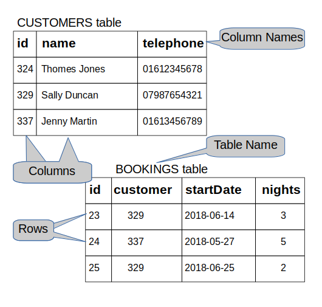

+++
title = 'Introduction to PostgreSQL'

time = 30
[objectives]
    1='Define what SQL is and what it is used for'
    2='Define an RDBMS'
    3='Validate a PostgreSQL installation'
[build]
  render = 'never'
  list = 'local'
  publishResources = false

+++

_"PostgreSQL is a powerful, open source object-relational database system that uses and extends the SQL language combined with many features that safely store and scale the most complicated data workloads. The origins of PostgreSQL date back to 1986 as part of the POSTGRES project at the University of California at Berkeley and has more than 30 years of active development on the core platform."_ (source: [postgresql.org](https://www.postgresql.org/about/))

### What is SQL?

- Pronounced S-Q-L or sequel
- Stands for Structured Query Language
- SQL is the standard language used to communicate with relational database
- SQL statements are used to query, create, update, delete records in a database as well as many other tasks
- SQL statements are executed by a RDBMS.

### What is an RDBMS?

- Stands for Relational Database Management System
- It is a program that processes SQL statements to manage a relational database
- PostgreSQL is an RDBMS.

### What characterizes a relational database?

As mentioned previously, a relational database is a specific type of database. Data is stored in _tables (relations)_ of _rows (tuples)_ and _columns (attributes)_ as per the example below:

