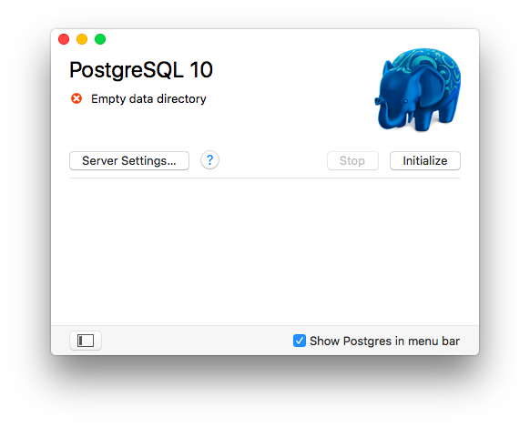
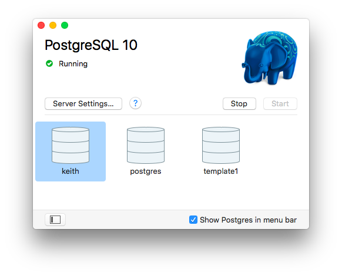

+++
title = 'Mac-OS setup'

time = 45
[objectives]
     1='Set up PostgresQL on Mac-OS'
[build]
  render = 'never'
  list = 'local'
  publishResources = false

+++

With the Apple Mac you can choose either a graphical installation or a command line method. The graphical method mostly involves dragging and dropping icons with a little bit of command line to configure the tools we need. The command line method uses only command line but is fairly simple.

### Graphical Installation

**Note that you must be logged in as a user with Administrator privileges on OSX for all these steps.**

From the Macintosh OSX system you can install PostgreSQL from the Postgres.app package. Download this from https://postgresapp.com but make sure you choose PostgreSQL version 12 and the appropriate platform for your Mac. Once you have downloaded Postgres you can open the disk image from your Downloads folder. Drag the Postgres icon to the Applications folder.


Open Applications in the Finder and start Postgres. When you receive the alert **"Postgres" is an application downloaded from the internet...** then click on the Open button. You may be prompted for other options (e.g. auto update, ...) and you can choose your own preference.

When the PostgreSQL window appears then click on the Initialise button to create your local PostgreSQL database and user - they will both have the same name as your OSX username.



PostgreSQL initialises itself, creating the initial databases (`template1`, `postgres` and `<your user name>`) along with corresponding users. These should then be displayed in the PostgreSQL window, as below:



### Configure the Command Line Interface (CLI)

To use the PostgreSQL command line tools you need to add the directory to your path (used to find commands in the terminal). There are several ways to do this but the simplest is to create a file containing the directory path name. Open the terminal and enter the appropriate commands from the list below (note: you may not need to create the directory):

```
# First check the destination directory exists:
ls /etc/paths.d/
# If the directory doesn't exist then create it:
sudo mkdir /etc/paths.d
# Create the path entry for Postgres:
echo /Applications/Postgres.app/Contents/Versions/latest/bin | sudo tee /etc/paths.d/postgresapp
```

From the terminal you can now type the simple command:

```
psql
```

and this should produce something like the following:

```
psql (12.4)
Type "help" for help.

keith=#
```

The final line is the psql command prompt, waiting for you to enter a command. It comprises your database name (created with the same name as your username, in the example this is 'keith') followed by '=#'.

You are going to rename the database to `my_hotels` for the purposes of this course, so from the psql prompt (as above) first disconnect from your database by connecting to database `postgres`:

```
keith=# \connect postgres
```

Now, still at the psql prompt, rename the database:

```
keith=# alter database keith rename to my_hotels;
```

Clearly, you'll use your own name as the name of the database to be renamed.

Note that to exit psql back to the terminal prompt use the command `\q`.

**MacOS Graphical Install Complete**

### MacOS Command Line Installation

You need Homebrew installed on your Mac to use this approach. If you don't yet have it then you should probably use the graphical method. If you already have Homebrew installed then the following command installs PostgreSQL:

```bash
brew install postgresql
```

This will install the software, set up the postgres user and a user with the same name as your Mac OS user and create some databases. It should leave the PostgreSQL server running on your Mac but if you power off the machine you'll need to restart it. To restart the server, type:

```bash
brew services start postgresql
```

This starts the server and ensures that it will be started each time you power up your Mac. Note you can stop the server at any time by using:

```bash
brew services stop postgresql
```
