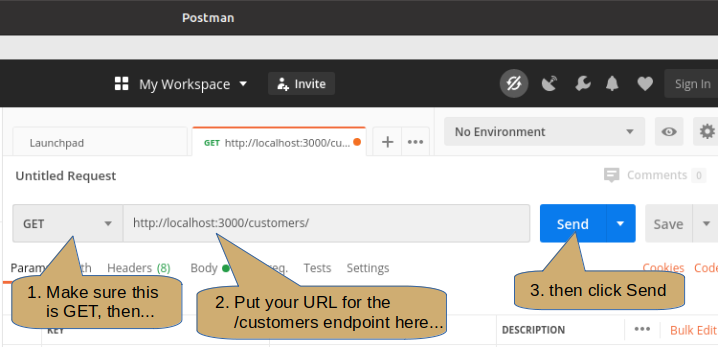
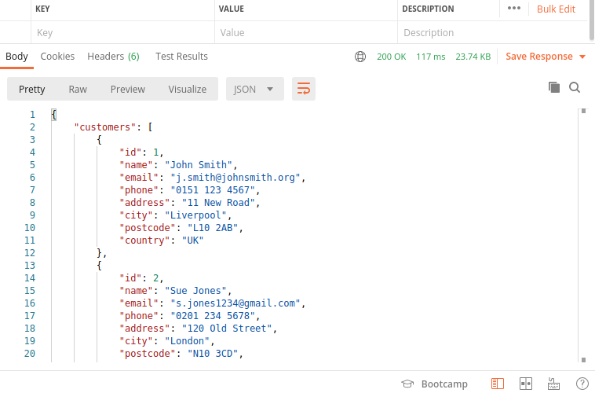

+++
title = 'Communicating with the database using SQL'

time = 30
[objectives]
    1='Check the database connection'
    2='Get query results from the database with Postman'
[build]
  render = 'never'
  list = 'local'
  publishResources = false

+++

Use the tables and data from your `_hotel` database. If you need to start from a clean state for your database, run `psql -d _hotel -f build_hotel.sql`.

Earlier, we created a new NodeJS project called `-hotels-api` with a single API endpoint `/customers` to get the list of all customers. Now, we will add other endpoints with more functionalities to interact with the `_hotel` database.

You should have a `server.js` file that looks something like this:

```js
const express = require("express");
const app = express();
const { Pool } = require("pg");

const db = new Pool({
  user: "keith",
  host: "localhost",
  database: "_hotel",
  password: "",
  port: 5432,
});

app.get("/customers", function (req, res) {
  db.query("SELECT * FROM customers")
    .then((result) => {
      res.status(200).json({ customers: result.rows });
    })
    .catch((err) => {
      console.log(err);
    });
});

app.listen(3000, function () {
  console.log("Server is listening on port 3000. Ready to accept requests!");
});
```

Before we move on, run the `server.js` file in node and check the endpoint using your browser.


===[[Using Postman]]===

### Using Postman to Test an API

You should have [Postman](https://www.postman.com/) already installed on your system. If not then please install it now.

Run Postman (it can be slow to start).



Check the method is GET, set the URL for your customers endpoint then click Send.



===[[👩🏽‍✈️👨🏾‍✈️Code along : Retrieving individual records]]===
https://www.youtube.com/watch?v=LNfZAI3dp10&list=PLozA7cloMbPhJgWwncnb-N4yI07JpUcs5&index=1


