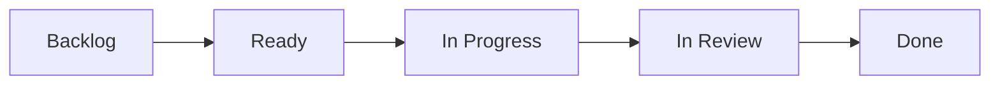

+++
title = 'Backlog'

time = 20
vocabulary=["Blockers"]
[objectives]
1='Define the backlog'
2='Explain how to use the sprint backlog'
[build]
  render = 'never'
  list = 'local'
  publishResources = false

+++

In software development, we break down complex projects into smaller, manageable parts, which we work on for a week or two. These periods are called "sprints."

A sprint backlog is like a to-do list. It lists what the team has decided to work on this sprint. It's chosen from a larger list, usually called the "product backlog," which holds the entire project to-do list.

The backlog is a set of work designed to build understanding beyond the concepts introduced in the course prep. For your course, we have prepared a backlog of mandatory work for each sprint. You will copy these tasks into your own backlog. You can also add any other tickets you want to work on to your backlog, and schedule all of the tasks according to your own goals and capacity. Use your planning board to do this.

You will find the backlog in the **Backlog** view on every sprint.

Copy the tickets you are working on to your own backlog. Organise your tickets on your board and move them to the right column as you work through them. Here's a flowchart showing the stages a ticket goes through:

