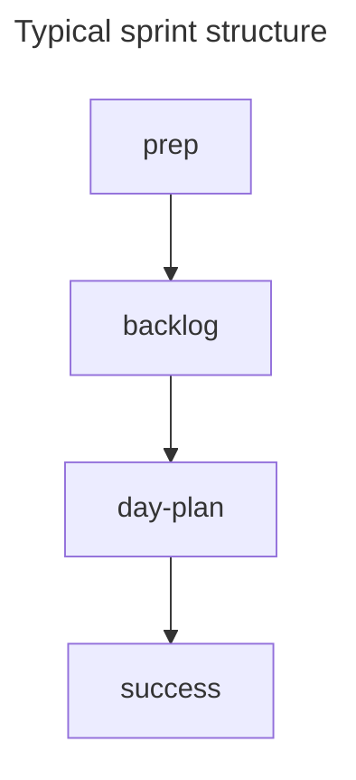

+++
title="📅 Day plan"
headless="true"
time= 30
[objectives]
    1="Describe how the day plan works"
    2="Identify some common recurring blocks in the day plan"
+++

The day plan sets out the agenda of activities that the community
Cohorts typically meet every Saturday in person to work on the material from the current week. To make the most of this time, we need a plan to organise workshops, study sessions and activities to make the most of our time together. You can find day plans on a particular sprint view. Each day plan consists of blocks that specify activities and their time throughout the day.

