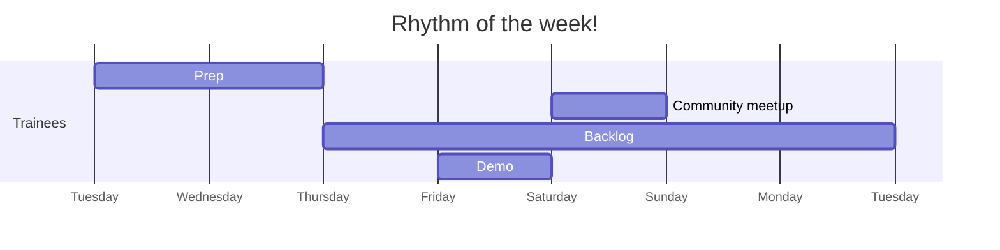

+++
title="🥁 Rhythm of the week"
headless="true"
time= 30
[objectives]
    1="Identify when prep takes place within the rhythm of the week"
    2="Identify when backlog takes place within the rhythm of the week"
    3="Identify when the in-person session takes place within rhythm of the week"
+++

Self-coordinating as a community poses several challenges. One of these challenges involves working out not just what to do but _when_ to do it. This becomes even more challenging with members of the community working at different times during the week. To further complicate matters we use a flipped classroom model - much different to a typical timetable.

To solve this problem, we introduce the **rhythm of the week**. This rhythm gives communities the rhythm they need to schedule various curriculum activities throughout the week. In this rhythm, think of **a week as starting on a Tuesday** with the **in-person session on Saturdays** serving as the mid-point in the week. Sundays and Mondays are used for

