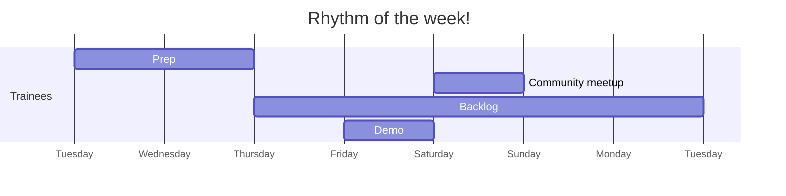

+++
title="🥁 Rhythm of the week"
headless="true"
time= 30
[objectives]
    1="Identify when prep takes place within the rhythm of the week"
    2="Identify when backlog takes place within the rhythm of the week"
    3="Identify when the in-person session takes place within rhythm of the week"
+++

