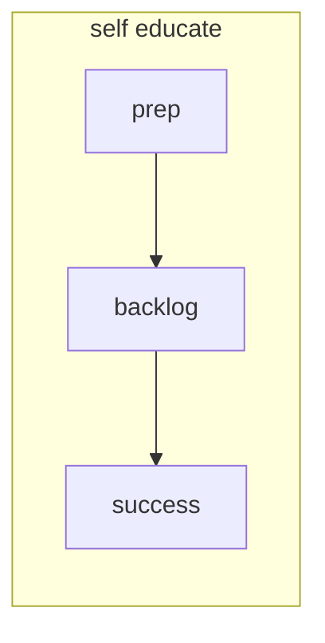

+++
title = 'Using this module'
time = 20
vocabulary=["Blockers"]
[objectives]
1='Explain how to use the rest of this module'
[build]
  render = 'never'
  list = 'local'
  publishResources = false

+++

The rest of this module has one sprint, which you can complete in your own time. Just like in all of our courses, for each sprint, you'll need to start with the **prep** to introduce yourself to new concepts before doing the tasks in the **backlog** to understand how you can start engaging with the community. At the end of each sprint, there is a **success** page. Make sure you have achieved all of the objectives in the list and check them off.

Ready, head to the [self educate sprint](../sprints/self-educate)
