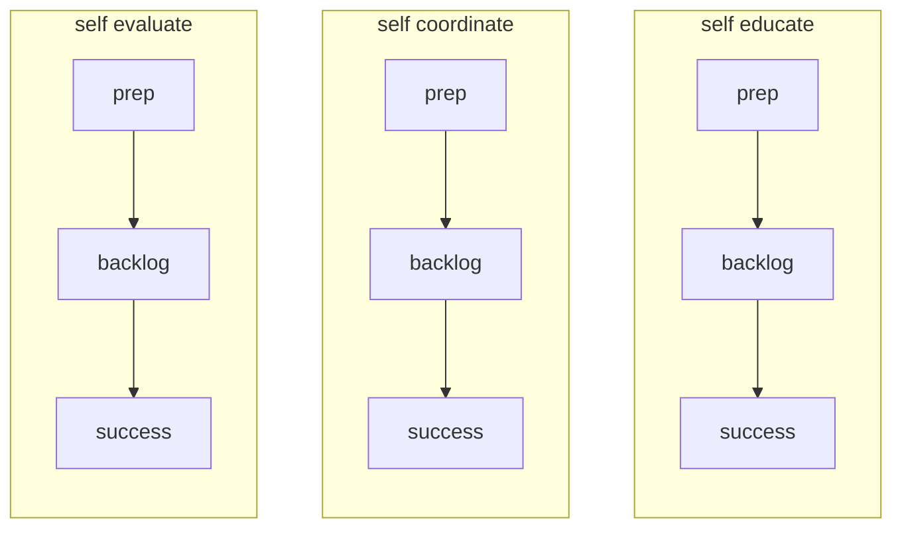

+++
title = '🛣️ Using this module'
headless = true
time = 20
facilitation = false
vocabulary=["Blockers"]
emoji= '🛣️'
[objectives]
1='Explain how to use the rest of this module'
+++

The rest of this module is split into three sprints, which you can complete in your own time: **self educate**, **self coordinate** and **self evaluate**. Each sprint concerns itself with the question of how the curriculum can be used to achieve each of these community goals. For each sprint, you'll need to start with the **prep** sprint to introduce yourself to new concepts before using the **backlog** to understand how you can start engaging with the community. For each sprint, there is a **success** page that defines the educational outcomes for each sprint.

Ready, head to the [self educate sprint](../sprints/self-educate)
