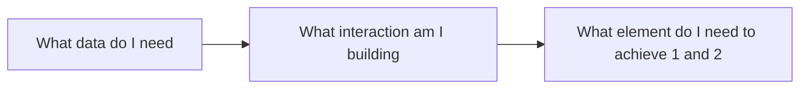

+++
title = 'What are forms?'

time = 60
hide_from_overview = true
[objectives]
    1='Define form, field, and input'
    2='Define form elements and attributes'
    3='Explain the purpose of validation'
    4='Write form validations'
[build]
  render = 'never'
  list = 'local'
  publishResources = false

+++

These questions and answers are compiled from recorded sessions on HTML forms, and are the collective contribution of several mentors and students. This time we've included a trainee answer and a mentor answer, per question.



So let's go deep on forms. What is a form? What does form mean?

🧑🏿‍💻💬 **Trainee:** What does form mean? It's like a set of options for a user to choose from on a website.

👩🏻‍💻💬 **Mentor:** Yes, that is true, that is a correct answer. A deeper answer might be form means _shape_. It's how we define the shape of data. So, imagine a shape sorter. You put a square thing in the square hole; you put a round thing in the round hole. Each form field is a different shape in the shape sorter lid. That's what we're doing when we write forms. We are _forming_ data with fields.

Why do we do that? Why do we bother grouping and shaping data in that way?

🧑🏿‍💻💬 **Trainee:** Of course because it makes it easier to sort it out.

👩🏻‍💻💬 **Mentor:** Yeah, absolutely! Because you know we're going to post that data to a database. Our database doesn't know what all these strings mean. We have to define the data. We have to label the data. We have to group it, and we have to do something with it: to post it to a database or in some cases, get it from a database.

So that's the point of all this.

What does field mean?

👩‍💻💬 **Trainee:** Field? It means like the window is completed with some information. A piece of data.

👩🏻‍💻💬 **Mentor:** Right! You put a piece into a form field; you just put _one thing_ in there. A form has many fields, and a field is a single piece of data. It is the smallest piece.

So we [structure data with forms](https://developer.mozilla.org/en-US/docs/Learn/Forms). And we do that by defining form fields with [semantic HTML](https://web.dev/learn/html/semantic-html).



Now practise with [How to structure a web form](https://developer.mozilla.org/en-US/docs/Learn/Forms/How_to_structure_a_web_form)



What else do we structure, when we write an HTML form?

🧑🏻‍💻💬 **Trainee:** Gathering data you mean? I'd be doing a search...

🧑🏿‍💻💬 **Trainee:** Can I say? We can structure... an action, a connection.

👩🏻‍💻💬 **Mentor:** Ooh, that's a great answer. We can structure _interaction_. We tell the user, _what_ to put in the form field, and _how_ to put that data in. We structure a really specific kind of interaction. We guide them and tell them what to do. And the way that we structure those interactions is, again, using form fields. Using HTML form elements, attributes, and values.

That's really important to think about, because when you're deciding what to write in a form, you need to start with 'what data do I need.' It's better to do that than to try and memorise all the different types of form fields. If you think:

Then [look up that last part](https://developer.mozilla.org/en-US/docs/Web/HTML/Element#forms). That's more effective than trying to memorise all the different types of form fields.

But saying that, let's name some form fields now -- some elements in HTML that we can use to structure data. I'm going to say, input of type text. Name a bunch more.

🧑🏿‍💻💬 **Trainee:** Yeah, maybe `checkbox`?

👩🏼‍💻💬 **Trainee:** `radio` button.

👨🏿‍💻💬 **Trainee:** submit `input` type, could be submit or `button` itself.

👩🏽‍💻💬 **Trainee:** `autocomplete`?

👨🏻‍💻💬 **Trainee:** I think `autocomplete` is an attribute, but it's not itself an element or element type? How about `textarea` ?

🧑🏿‍💻💬 **Trainee:** `select` and `option`

👨‍💻💬 **Trainee:** The `input` of type `password`...

👩🏻‍💻💬 **Mentor:** The point being that there are absolutely loads of different form elements!

What you need to focus on is _what you're actually doing_. We're structuring data: you are defining, naming and then grouping data. Keep that goal front and center, then your forms will work well.


[Test Your Skills](https://developer.mozilla.org/en-US/docs/Learn/Forms/Test_your_skills:_Basic_controls)


Oh and... what does input mean?

🧑🏿‍💻💬 **Trainee:** Input means to put something in. In this case the data we put in the form.

👩🏻‍💻💬 **Mentor:** Bang on.

What happens when things don't work well. What happens when the user puts the wrong thing in a field?

🧑🏿‍💻💬 **Trainee:** Do you mean validation? Don't we need JavaScript for that?

🧑🏾‍💻💬 **Mentor:** We'll learn about validation with JavaScript later on, but there's actually a lot of [validation built in](https://developer.mozilla.org/en-US/docs/Learn/Forms/Form_validation#using_built-in_form_validation) to HTML. For example, if you put [a `required` attribute](https://www.w3.org/WAI/tutorials/forms/validation/#validating-required-input) on a field, the browser will not let you submit the form until you fill in that field. That's validation: it checks against rules and rejects the data if it doesn't meet the rules.

🧑🏿‍💻💬 Trainee: But then aren't all form elements validation?

🧑🏽‍💻💬 **Mentor:** You _could_ say that all the rules you make about what the user can put in a field are also validation. Every `type` we just named - input type checkbox, input type email, number, [date](https://developer.mozilla.org/en-US/docs/Web/HTML/Element/input/date)... are rules about data.

I think the difference is that there's no way to type into a checkbox: there's no error message, you just can't do it. If you type your birthday into an email field, the browser will tell you that's not a valid email address. So one is just impossible to do and the other gives you an error message, and that's normally what we mean by validation.

Why is it important to validate data?

👨🏻‍💻💬 **Trainee:** Because if you don't validate it, you might not be able to use it?

🧑🏾‍💻💬 **Mentor:** Right. Forms go wrong when you are vague. You must enforce input with validation, because if users _can_ get it wrong, they will.

https://www.youtube.com/watch?v=baY3SaIhfl0

What will happen if you put a type of text on an input you label with email?

👨🏾‍💻💬 **Trainee:** Oh well then people will write in things that aren't email addresses?

🧑🏿‍💻💬 **Trainee:** And you won't know until you try to send them an email...

👩🏻‍💻💬 **Mentor:** Yeah they will. You can be absolutely guaranteed that users will do that. You have to save them from themselves, and save your database from your users!


Now try some of the [built in form validation examples](https://developer.mozilla.org/en-US/docs/Learn/Forms/Form_validation#built-in_form_validation_examples)




