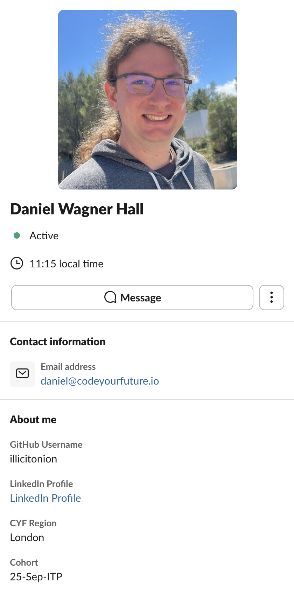

+++
title="Professional Accounts"
emoji="🔐"
time=45
objectives=["Create a professional Google account", "Download and install the apps you will need to complete the course"]
hide_from_overview=true
[build]
  render = 'never'
  list = 'local'
  publishResources = false

+++

Download and install the following software or register for the apps if you have not done so already.

Click on the links to go to the registration pages. Keep your login details for all sites/apps consistent and always use your real name.

> [!IMPORTANT]
>
> ##### Real name
>
> We recognise you may need to keep your birth name private. When we say real name, we mean the name you go by. It does not have to match your birth certificate or any other legal document. It has to be consistent and professional.

Every time you create an account which can have a profile picture, you should set one up. Follow these [professional image guidelines](https://www.linkedin.com/business/talent/blog/product-tips/tips-for-taking-professional-linkedin-profile-pictures) when picking an image. Use the same picture for every account.


We understand you may need to keep your picture off the internet. In this case, generate [a robohash picture](https://robohash.org/) from your name, and use that for all these accounts. Use your robohash consistently and it will help us recognise each other.


### Gmail, Google Account

Make a new Google account if you do not have a professional one already. What is a professional email address?

1. Use your real name.
1. Don’t use any numbers or words that are not your name.
1. **Never** put the year of your birth or age in your professional email address.

Your email address should look something like this:

> GivenName_FamilyName@gmail.com

This is your public professional email address. Use it to sign up for all your professional accounts unless you can use your GitHub.

- [ ] I have made a professional Google account and Gmail address.
- [ ] I have explored the [Google Suite](https://applieddigitalskills.withgoogle.com/c/en/workspace), such as calendar, docs and spreadsheets.

### GitHub

You will use [GitHub](https://github.com/signup) to store your code and to collaborate with your peers. You have already made a GitHub account, but you need to check it is professional. You can change your username in your settings. You can add your professional email address in your settings too. (You can have more than one email address on your account.)

- [ ] My GitHub account shows my professional name
- [ ] I have added my professional email address to my GitHub account.

### LinkedIn

Sign up for LinkedIn. LinkedIn is the largest professional social network. You will use it to help you get a job and to advance your career.

Make a LinkedIn account. Use your real name. Sign in with Google. Connect with your cohort.

Your cohort is your first network, and this is one of the most valuable things you can develop at . A strong, tightly linked, professional network is a powerful asset, so begin building it today.

- [ ] I have made a LinkedIn account using my professional email address.
- [ ] I have used my real name.
- [ ] I have connected with my cohort.
- [ ] I am following .

### Slack

[Slack](https://slack.com/intl/en-gb) is our community space and how we communicate with each other. Download and install it now. If you are not using your own computer, log in to the web version instead.

- [ ] I have downloaded the [Slack](https://slack.com/intl/en-gb) app on my computer and phone.
- [ ] I have logged in to the  ITP workspace.
- [ ] I have found and joined my class channels.
- [ ] I have updated my profile with my picture, my professional email address, my GitHub username, my Linkedin profile, my region, and my cohort.
- [ ] I have introduced myself on Slack.

See this example fully filled-in Slack profile - make sure yours has at least the same fields filled on:

## Applications

If you're working on a library computer, you can't download these applications. You will use [GitHub Dev](https://github.dev/) to complete coursework instead.

### Google Chrome

- [ ] I have downloaded and installed Google Chrome.
- [ ] I have logged into my professional profile on Chrome.

Use your professional Chrome profile for all your  work. You will often have to share your screen during sessions, so keep your personal internet use private and away from your professional profile.

### VSCode

We will use [Visual Studio Code](https://code.visualstudio.com/) (VSCode), a professional IDE you will use on this course and at work.

- [ ] I have downloaded and installed [Visual Studio Code](https://code.visualstudio.com/).

### Zoom

Usually we use [Meet](https://applieddigitalskills.withgoogle.com/c/college-and-continuing-education/en/google-meet-for-beginners/overview.html), but sometimes we use [Zoom for remote sessions](https://zoom.us/download). Install it now.

- [ ] I have downloaded and installed [Zoom](https://zoom.us/download) onto my computer.
