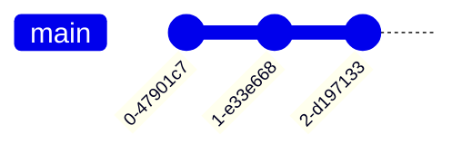
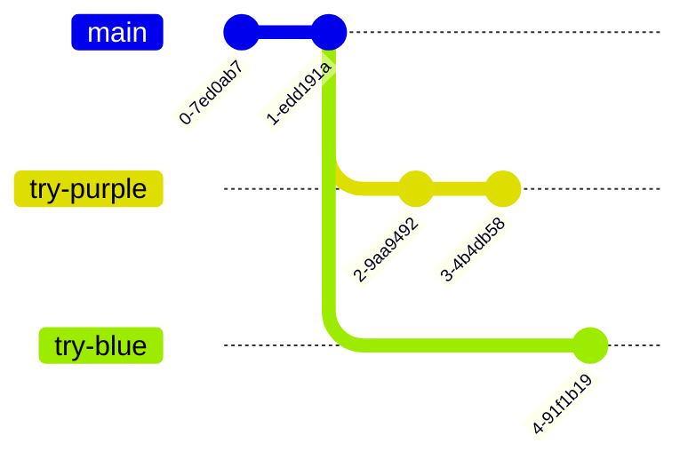

+++
title = 'Branching'
time =45
emoji= '🌳'
[objectives]
    1="Explain why a git repository may have multiple branches"
    2="Describe what's special about the branch named main"
    3="Create a new local branch in a git repository"
[build]
  render = 'never'
  list = 'local'
  publishResources = false

+++

This exercise is hosted on the GitHub repository of our partner NGO, **Code Your Future** (UK), and **not** on a MigraCode-owned repository.
We are part of a European network where we share resources and support each other as we share the same mission -  to provide free, high-quality tech education to our communities.

The exercise works as intended — you are free to **fork and clone** the repository as usual, if required by the exercise.

However, please do not make any pull requests to the original Code Your Future repository.


We can check the commits on the remote repository as before:

On the left page of the page, we see additional information:

> So what is **`main`**?

`main` is a **branch**.

Commits form a sequence that look like this:

A branch represents a particular history of development in a project - the different versions there have been.



A **branch** is a sequence of commits in a project.



There can be different branches with different names, which may have different versions.

For example, if we were testing out some different visual styles, maybe we would have one branch with some extra changes which make the website more blue, and a different branch with some extra changes which make the website more purple. These branches may share some commits in history, but have some extra different commits separately.

The **`main`** branch is often treated as a special branch - it's where we put commits which people working on the project have agreed on. Other branches (e.g. the experimental purple branch) may have extra changes that have not been agreed on. If people working on the project agree the changes from the purple branch are good, we'll add those changes to the main branch.

When we're working on something new, we haven't agreed with other people that our new thing is good yet, so we often don't add our changes to the main branch straight away. Instead we make our own branch to experiment on.

We can start to create independent branches like this:

In the diagram above, we can continue to commit on the "week-1-coursework" branch without altering the history of the `main` branch.



### Creating a local branch

1. Open the `education-blog` repository in VSCode.

2. Using this clip, create a new branch called `update-blog-1` in your local repository 👉 https://youtube.com/clip/UgkxvXsnm_98Rx0NUZq25apQWA6POccRoQzw

📋 How can you check that you've successfully created a branch?


