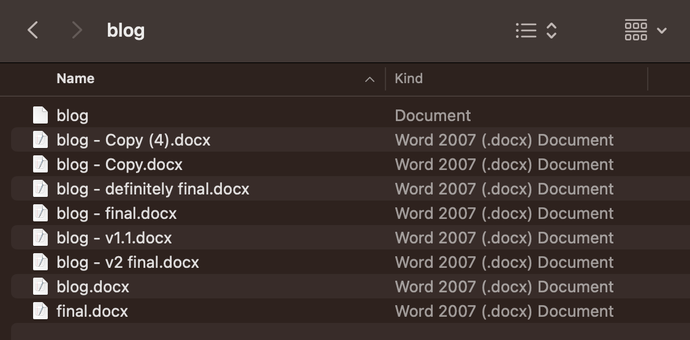

+++
title = 'Development process'
time ="10"
hide_from_overview = true
[build]
  render = 'never'
  list = 'local'
  publishResources = false

+++

Ahmed and Naima are using the following **development process** for writing their blog:

- Writing the blog in a single file on a **single** computer
- Saving multiple versions of the file on the same computer
- Taking turns to use the computer during the day

At the moment, the computer has a folder with the blog that looks like this:



Describe some of the challenges that Ahmed and Naima face when trying to write a blog together in this way.

Look in Slack. Has someone made a post describing Ahmed and Naima's challenge? Share your answers as a **reply** to this post, making a [conversation 🧵 thread](https://slack.com/intl/en-gb/help/articles/115000769927-Use-threads-to-organise-discussion).


