+++
title = 'Forking a repository'
time ="10"
emoji= '🍴'
[objectives]
    1="Create a fork of a repository"
[build]
  render = 'never'
  list = 'local'
  publishResources = false

+++


This exercise is hosted on the GitHub repository of our partner NGO, **Code Your Future** (UK), and **not** on a MigraCode-owned repository.
We are part of a European network where we share resources and support each other as we share the same mission -  to provide free, high-quality tech education to our communities.

The exercise works as intended — you are free to **fork and clone** the repository as usual, if required by the exercise.

However, please do not make any pull requests to the original Code Your Future repository.


Often we want to take an existing project and start working on it independently. In other words: we start making our own versions of the project separate from the original project.

We can create a A **fork** is a copy of a repository that exists on Github.

When we create a fork on Github, the new forked repository gets a new url:

#### https://github.com/CodeYourFuture/cyf-demo-repo

```mermaid
flowchart LR
    subgraph "📍 domain"
      B
    end
    subgraph "👤 username"
      C
    end
    subgraph "📁 repo"
      D
    end
    A[🔗 https://] --> B[github.com]
    B--> C[CodeYourFuture]
    C --> D[cyf-demo-repo]
```

When the user EagerLearner forks this repo, the path changes from `CodeYourFuture` to `EagerLearner`.

```mermaid
flowchart LR
    subgraph "📍 domain"
      B
    end
    subgraph "👤 username"
      C
    end
    subgraph "📁 repo"
      D
    end
    A[🔗 https://] --> B[github.com]
    B--> C[EagerLearner]
    C --> D[cyf-demo-repo]
```



### 🍴 Fork a repo

1. Go to https://github.com/CodeYourFuture/education-blog.
1. Find the **Fork** button on this page.
1. Click on the Fork button to create a new fork of the repository and set yourself as the owner of the fork.

📋 How can you check you successfully forked the original repository?

Hint: Check the URL of your forked repository


