+++
title = 'Forking a repository'
time ="10"
facilitation = false
emoji= '🍴'
[objectives]
    1="Create a fork of a repository"
[build]
  render = 'never'
  list = 'local'
  publishResources = false

+++

Often we want to take an existing project and start working on it independently. In other words: we start making our own versions of the project separate from the original project.

We can create a A **fork** is a copy of a repository that exists on Github.

When we create a fork on Github, the new forked repository gets a new url:

#### https://github.com/CodeYourFuture/cyf-demo-repo

```mermaid
flowchart LR
    A[🔗 https://] -->|domain| B[📍github.com]
    B-->|username| C[👤 CodeYourFuture]
    C -->|repo| D[📁 cyf-demo-repo]
```

When the user EagerLearner forks this repo, the path changes from `CodeYourFuture` to `EagerLearner`.

```mermaid
flowchart LR
    A[🔗 https://] -->|domain| B[📍github.com]
    B-->|username| C[👤 EagerLearner]
    C -->|repo| D[📁 cyf-demo-repo]
```



### 🍴 Fork a repo

1. Go to https://github.com/CodeYourFuture/education-blog.
1. Find the **Fork** button on this page.
1. Click on the Fork button to create a new fork of the repository and set yourself as the owner of the fork.

📋 How can you check you successfully forked the original repository?

Hint: Check the URL of your forked repository


