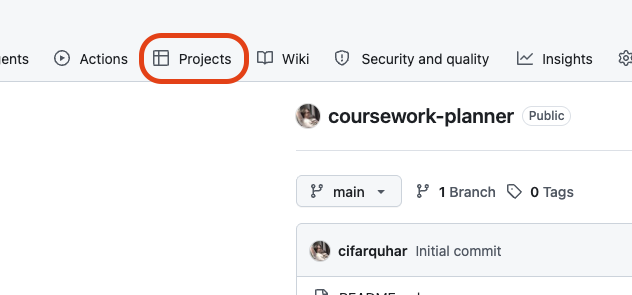
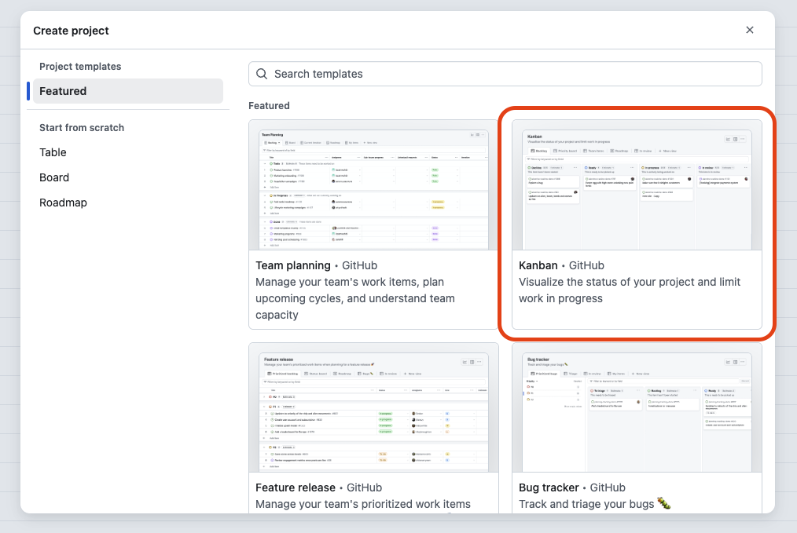
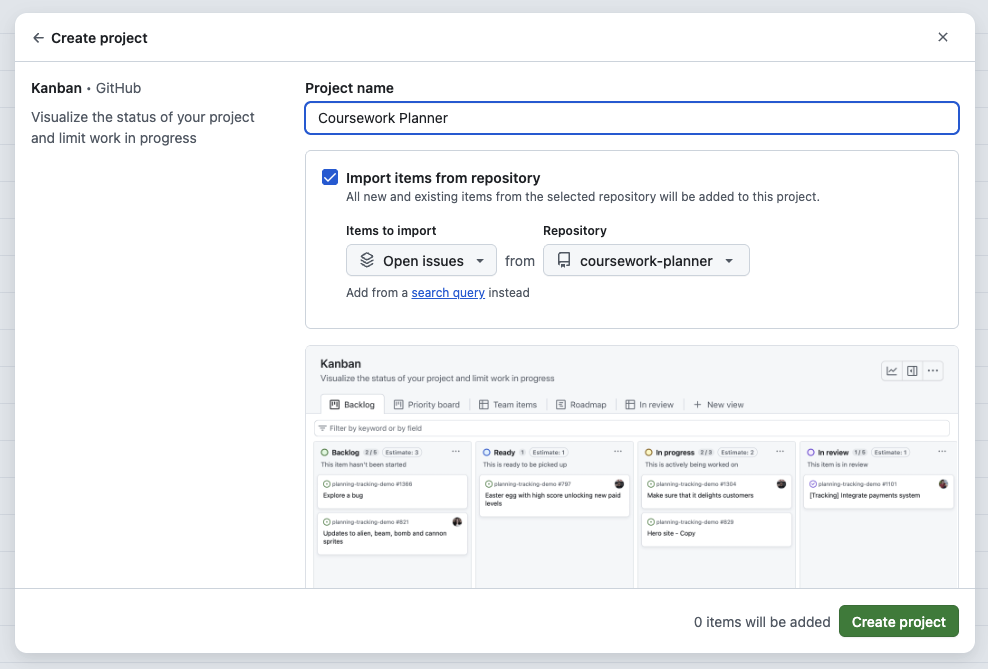
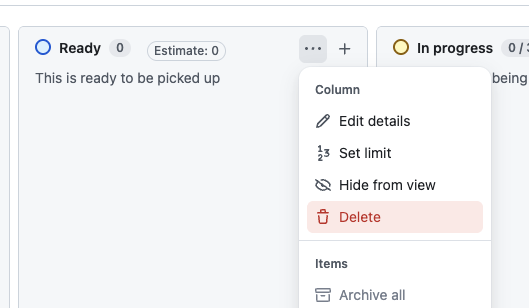
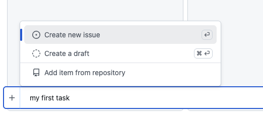
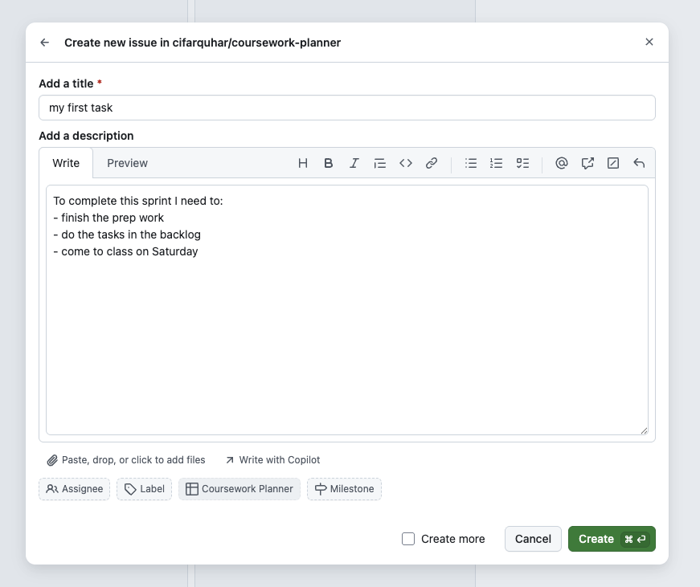

+++
title = 'Setting Up Your Planner'

time ="30"
[objectives]
    1='Create a GitHub Project to manage your coursework'
    2='Create an issue from the project view'
[build]
  render = 'never'
  list = 'local'
  publishResources = false

+++

As you work through the course there will be a lot of tasks for you to complete. Some will involve writing code, others will involve research or other activities. It's very important to keep track of your to-do list, otherwise you will find it challenging to get everything done. In this section we will use GitHub's built-in project tools to get started.

## Setting up a project

### 1. Creating a repository

GitHub's projects work by tracking individual items called **issues**. Each issue represents something on our to-do list and we can prioritise them, add labels to them and even link them to other related issues. We will look at issues in more depth in a workshop at the end of this sprint.

Any issue we create needs to be associated with a repository. If we were creating a product we would use the repository containing our code, but this time we will create an empty repository just to handle our issues.


Go to GitHub and create a new repository called `coursework-planner`. 


### 2. Creating the project

Once we have a repository to work with we can create our project. From the repository page look at the top tool bar and click the `Projects` button.

The next screen shows all the projects associated with this repository, but for now it just tells us we don't have any yet. Click one of the green "new project" buttons to continue. This will give us a number of templates to choose from. Select the "Kanban" option.

> A [Kanban board](https://business.adobe.com/uk/blog/basics/what-is-kanban) is a visual representation of a project's progress. It splits tasks into lists of things which are still to be done, things which are in progress and things which are complete.

On the next screen we will provide the details of our project:
- In the `Project name` field replace the default with "Coursework Planner"
- Check the `import items from repository` box is ticked and the `Repository` dropdown has the repo you just created selected. This should have happened by default, but it never hurts to check

Click the green button to create your project.

### 3. Finishing setup

We're almost ready to start adding tasks but we need to clear up some things first. We don't need the `Ready` column so let's delete it. Click the three dots next to the column name, then click "Delete".

By default GitHub puts a limit on how many items we can have on a list, but we don't want that. Find the `Backlog` column and click the three dots again. This time click "Set limit" and then "Remove limit" in the popup which appears.

This is your planner and it's up to you to keep it up to date! The defaults are sensible options for our needs but you can customise it any way you want.


- The `In Progress` and `In Review` columns both have limits on how many tickets they can have. Remove them in the same way as you did for `Backlog`.
- Explore the "Edit details" menu item and see what you can change. Try changing the colour of one of the columns.


### 4. Creating an issue

It's time to add some things to our backlog. Hover your cursor over the `Backlog` column and you will see an "add item" button appear. Click it and a text field will appear at the bottom of the page.

Type "my first task" in the text field and take a look at the popup which appears. Ensure "create new issue" is selected and press the enter key, or click the plus sign next to the text field.

Now we can add details of the task. The screenshot below shows an example, but when you add something to your planner you should include all the relevant details from the backlog ticket.

> **Read the instructions carefully!** Some backlog items will ask you to give an issue a specific title, or to include specific information

Once you have finished adding the relevant information you can click the "Create" button to add the issue to your backlog. Now you can click and drag it between boards as you work on it.

