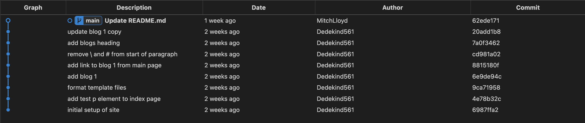

+++
title = 'Version control software'

time="10"
emoji= '⌛'
[objectives]
1='Define a repository'
2='Define a commit'
3='Explain the purpose of version control software'
[build]
  render = 'never'
  list = 'local'
  publishResources = false

+++

This exercise is hosted on the GitHub repository of our partner NGO, **Code Your Future** (UK), and **not** on a MigraCode-owned repository.
We are part of a European network where we share resources and support each other as we share the same mission -  to provide free, high-quality tech education to our communities.

The exercise works as intended — you are free to **fork and clone** the repository as usual, if required by the exercise.

However, please do not make any pull requests to the original Code Your Future repository.


To improve their way of working, Ahmed and Naima realise they need the following:

> - a way to both know what the most recent version is
> - a way to know what the old versions were, and in what order (i.e. how they got to the current version, and what content they may have deleted that they may want to get back)

To manage the different versions of the blog project, they decide to use **Git**.



Git is **version control software** that allows developers to create and manage different versions of a project.



In Git, we create different versions of a project over time by creating **commits**.

A **commit** is a snapshot of our project at a particular point in time. You can also think of a **commit** as a particular version of a project.

**Commits** store the following information:

- what changed in this commit
- who created the change
- what time the change happened
- what the previous commit was

A typical timeline of commits might look like this:


Commits also have a **hash** associated with them. A **hash** is a long string of characters used to identify a particular commit.

A typical hash will look like this: `fec6909d6de23c75e77960986a9b6a7aee7feec7` but you will often see them abbreviated to the first few characters like this: `fec6909`


