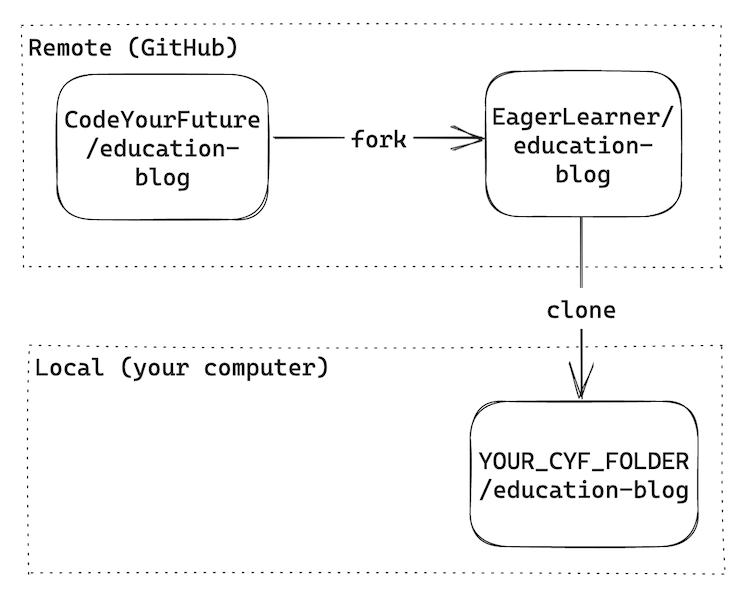

+++
title = '📘 Viewing the files'

time ="20"
facilitation = false
emoji= '🧩'
[build]
  render = 'never'
  list = 'local'
  publishResources = false

+++

Once you've got a local copy of a codebase on your local machine you can start to view the files and folders in that codebase. You can use a code editor like VSCode.

VSCode is an application that enables developers to view and edit files on their local machine.



### Explore VSCode

1. Figure out how to open the cloned repository on your local machine in VSCode.

2. Explore the repository in VSCode and use the code editor to look at the various files and folders.

3. Try opening the Integrated Terminal in your VSCode window

🤔 If you get stuck on any of these exercises, it's a good idea to search online. For example, you could Google "opening terminal in vscode"



Here is a diagram representing how the repositories interact after forking and cloning:

