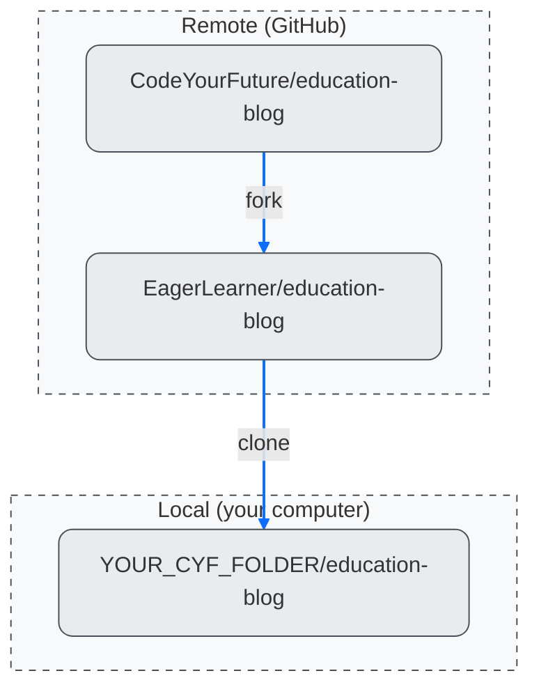

+++
title = 'Working locally'

time ="20"
emoji= '🏠'
[objectives]
    1='Clone a remote repository from GitHub into a local folder'
    2="Define the terms 'remote' and 'local' in the context of GitHub"
[build]
  render = 'never'
  list = 'local'
  publishResources = false

+++


This exercise is hosted on the GitHub repository of our partner NGO, **Code Your Future** (UK), and **not** on a MigraCode-owned repository.
We are part of a European network where we share resources and support each other as we share the same mission.

The exercise works as intended — you are free to **fork and clone** the repository as usual, if required by the exercise.

However, please do not make any pull requests to the original Code Your Future repository.


### 📌 Understanding Forking and Cloning

Here is a diagram representing how repositories interact after forking and cloning:

Sketch this diagram in your notebook. When you inevitably get confused about where your changes live, this visual will help you understand the flow of changes between repositories.

> \[!NOTE]
> If you're using a **library computer**, you can fork the repository to your GitHub account, but you **won’t be able to clone it locally**. Come to class to try cloning on your own machine. In the meantime, you can explore the files using [GitHub.dev](https://github.dev) just as you would in Visual Studio Code.

---

In addition to using GitHub through the browser, we can also use **Git on our local machine** to perform similar tasks. So, here's the key question:

> **How can we get a copy of an existing GitHub repository onto our local computer?**

In Git terms, this means creating a A repository on GitHub is a **remote** repository. A version of it on your own computer is called a **local** repository..

The process of copying a remote repository to your local machine is called **cloning**. The resulting copy is referred to as a **clone**.

---

### 🌟 Goal: Clone a remote repository to your local machine

You’ll need to **clone your fork** of the education blog repository. Follow along with this video for step-by-step instructions:
---

##### 🎗️ Reminder:

* Make sure you’re cloning **your fork** of the `education-blog` repository (not the original).
* Choose the `MCB` folder you created in the [module prep](/user-data/prep/#create-cyf-folder) as the destination for your clone.

---

> 💡 **Industry Insight:**
> While forking is useful for learning, **companies typically don’t use forking** when working on internal projects. Instead, developers clone the original (or central) repository and collaborate by creating branches and pull requests within that shared repo. Forking creates a separate copy under your own account.
