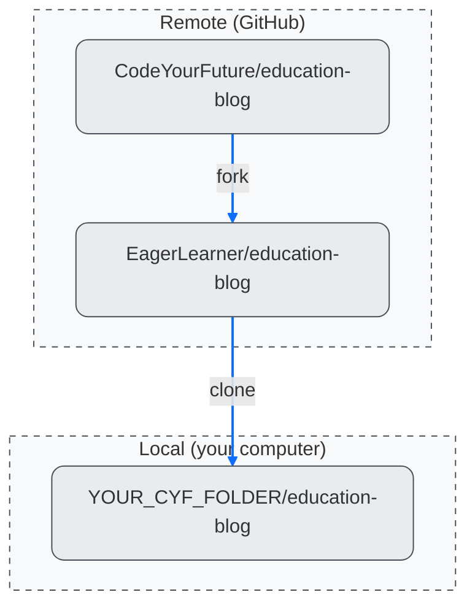

+++
title = 'Working locally'

time ="20"
[objectives]
    1='Clone a remote repository from GitHub into a local folder'
    2="Define the terms 'remote' and 'local' in the context of GitHub"
[build]
  render = 'never'
  list = 'local'
  publishResources = false

+++

Here is a diagram representing how the repositories interact after forking and cloning:

Sketch this diagram in your notebook. When you inevitably get mixed lost about where your changes are, you can refer back to this diagram to help you understand what's happening.

> [!NOTE]
> If you're working on a library computer, just fork the repo to your own GitHub account. You can't clone a repo on a library computer, so come to class to try cloning out. You can explore the files using dot dev in the same way as you would in Visual Studio Code.

We can also use Git on our local machine to perform similar tasks as we do on GitHub. So we need to address the following question:

> How can we get a copy of an existing GitHub repository on our local machine?

In other words, we need to get a A repository on GitHub is said to be **remote**. A repository on our own computer is said to be **local**. of the repository which is on GitHub.

We call a local copy of a GitHub repository a **clone**. The process of copying a remote repository on to a local machine is called **cloning**.

### 🎯 Goal: Clone a remote repository to your local machine

You'll need to clone **your fork** of the education blog repo. Follow through the steps in the video "How to clone a repository from GitHub to Visual Studio Code".

https://www.youtube.com/watch?v=ILJ4dfOL7zs

##### 🎗️ Reminder:

- Use the URL for your fork of the `education-blog` repo when you are cloning
- When selecting the location to clone your files, choose the `CYF` folder you created in the [module prep](/user-data/prep/#create-cyf-folder)
