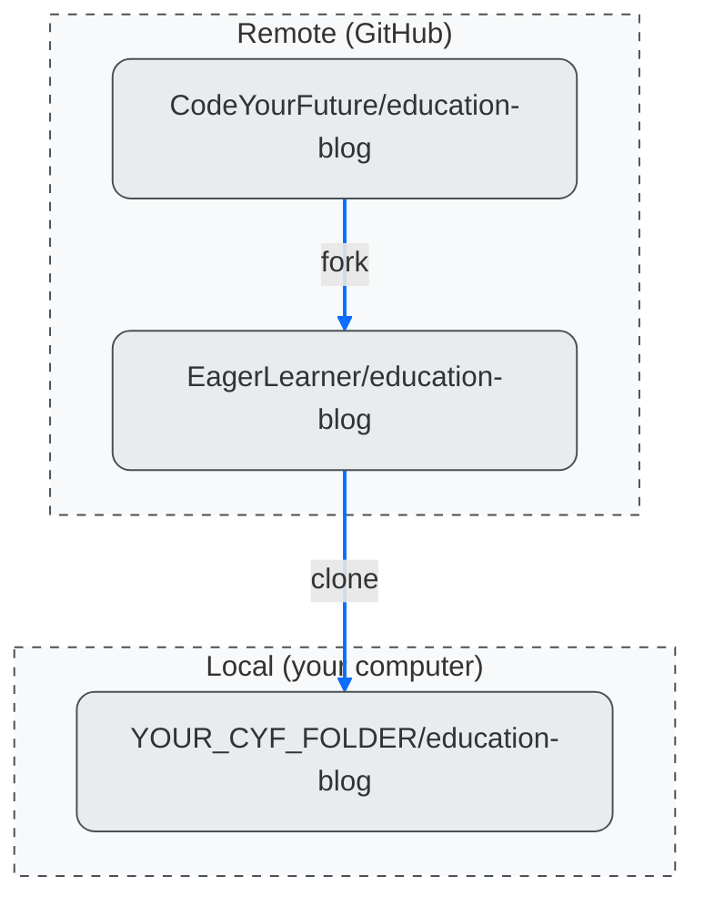

+++
title = 'Working locally'

time ="20"
[objectives]
    1='Clone a remote repository from GitHub into a local folder'
    2="Define the terms 'remote' and 'local' in the context of GitHub"
[build]
  render = 'never'
  list = 'local'
  publishResources = false

+++

GitHub is an really useful tool for aiding collaboration, but when it comes to writing and updating the code for a project, we tend to want the flexibility that comes with working on our A **machine** in this context is any computer, and your **local machine** is the computer (laptop or desktop) on which you do your work.. So we need to address the following question:

> How can we get a copy of an existing GitHub repository on our local machine?

In other words, we need to get a A repository on GitHub is said to be **remote**. A repository on our own computer is said to be **local**. of the repository which is on GitHub.

We call a local copy of a GitHub repository a **clone**. The process of copying a remote repository on to a local machine is called **cloning**. Watch the video below to see instructions on one of the ways you can clone a repo: using the Visual Studio Code interface.

https://www.youtube.com/watch?v=ILJ4dfOL7zs



##### 🐑 Clone a Repo

Follow the steps in the above video to make a local copy of the education blog repo that you forked in the previous step.

##### Reminders:

- Use the URL for **your fork** of the `education-blog` repo when you are cloning, not the URL for the original CYF repo
- When selecting the location to clone your files, choose the `CYF` folder you created in an earlier task
- If you are working on a library computer, you won't be able to clone the repo so come to class to try cloning out. In the meantime, you can explore the files using dot dev in the same way as you would in Visual Studio Code



For a visual reference, here is a diagram representing how the repositories interact after forking and cloning:

```mermaid
flowchart TD
    subgraph Remote["Remote (GitHub)"]
        A["CodeYourFuture/education-blog"] -->|fork| B["EagerLearner/education-blog"]
    end

    B -->|clone| C

    subgraph Local["Local (your computer)"]
        C["YOUR_CYF_FOLDER/education-blog"]
    end

    %% Style definitions
    classDef container stroke-dasharray:5 5,fill:#f8f9fa,stroke:#495057
    classDef rounded rx:10,ry:10,fill:#e9ecef,stroke:#495057
    classDef arrow color:#0d6efd,stroke-width:2px

    %% Apply styles
    class Remote,Local container
    class A,B,C rounded
    linkStyle 0,1 stroke:#0d6efd,stroke-width:2px
```

Sketch this diagram in your notebook. When you inevitably get mixed up or lost about where your changes are, you can refer back to this diagram to help you understand what's happening.
