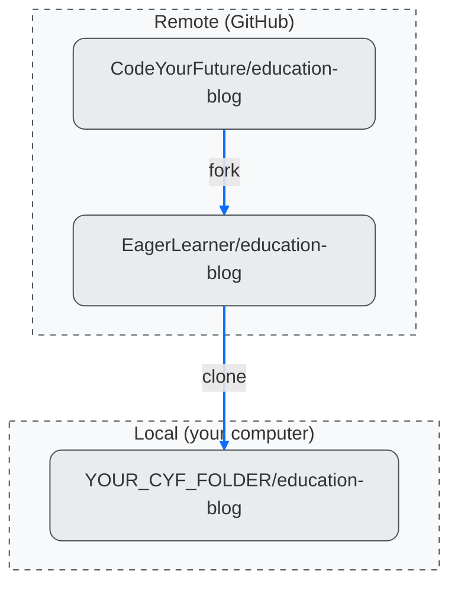

+++
title = 'Working locally'

time ="20"
[objectives]
    1='Clone a remote repository from GitHub into a local folder'
    2="Define the terms 'remote' and 'local' in the context of GitHub"
[build]
  render = 'never'
  list = 'local'
  publishResources = false

+++

Before we can work on it we need to get a **local copy** of the education blog repo. A repository on GitHub is said to be **remote** and a repository on our own computer is said to be **local**.

We call a local copy of a GitHub repository a **clone**. The process of copying a remote repository on to a local machine is called **cloning**.

Here is a diagram representing how the repositories interact after forking and cloning:

```mermaid
flowchart TD
    subgraph Remote["Remote (GitHub)"]
        A["CodeYourFuture/education-blog"] -->|fork| B["EagerLearner/education-blog"]
    end
    
    B -->|clone| C
    
    subgraph Local["Local (your computer)"]
        C["YOUR_CYF_FOLDER/education-blog"]
    end
    
    %% Style definitions
    classDef container stroke-dasharray:5 5,fill:#f8f9fa,stroke:#495057
    classDef rounded rx:10,ry:10,fill:#e9ecef,stroke:#495057
    classDef arrow color:#0d6efd,stroke-width:2px
    
    %% Apply styles
    class Remote,Local container
    class A,B,C rounded
    linkStyle 0,1 stroke:#0d6efd,stroke-width:2px
```

Sketch this diagram in your notebook. If you get confused about where your changes are you can refer back to this diagram to help you understand what's happening.

How can we get a copy of an existing GitHub repository on our local machine?



You'll need to clone **your fork** of the education blog repo. Follow through the steps in the video "How to clone a repository from GitHub to Visual Studio Code".

https://www.youtube.com/watch?v=ILJ4dfOL7zs

#### Reminder:

- Use the URL for your fork of the `education-blog` repo when you are cloning
- When selecting the location to clone your files, choose the `CYF` folder you created in the [module prep](/user-data/prep/#create-cyf-folder)

