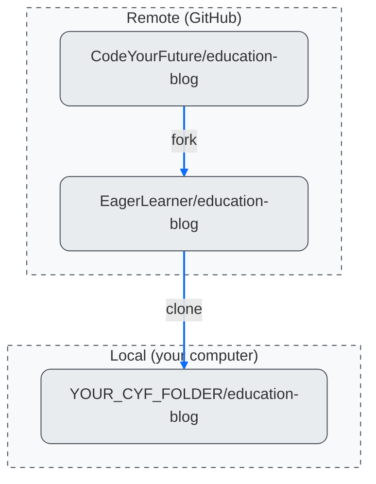

+++
title = 'Working locally'

time = 20
[objectives]
    1='Clone a remote repository from GitHub into a local folder'
    2="Define the terms 'remote' and 'local' in the context of GitHub"
[build]
  render = 'never'
  list = 'local'
  publishResources = false

+++

Before we can work on it we need to get a **local copy** of the education blog repo. A repository on GitHub is said to be **remote** and a repository on our own computer is said to be **local**.

We call a local copy of a GitHub repository a **clone**. The process of copying a remote repository on to a local machine is called **cloning**.

GitHub is an really useful tool for aiding collaboration, but when it comes to writing and updating the code for a project we tend to want the flexibility that comes with working on our computer. So we need to address the following question:

> How can we get a copy of an existing GitHub repository on our local machine?

In other words, we need to get a **local copy** of the repository which is on GitHub.

Watch the video below to see instructions on one of the ways you can clone a repo: using the Visual Studio Code interface.

https://www.youtube.com/watch?v=ILJ4dfOL7zs



Follow the steps in the above video to make a local copy of the education blog repo that you forked in the previous step.

#### Reminders:

- The "Clone Repository" button won't be visible if you are already working in another repository. If you are already working in a repo you can close it by selecting `File --> Close Folder`
- Use the URL for **your fork** of the `education-blog` repo when you are cloning, not the URL for the original CYF repo
- When selecting the location to clone your files, choose the `CYF` folder you created in an earlier task



For a visual reference, here is a diagram representing how the repositories interact after forking and cloning:

```mermaid
flowchart TD
    subgraph Remote["Remote (GitHub)"]
        A["CodeYourFuture/education-blog"] -->|fork| B["EagerLearner/education-blog"]
    end

    B -->|clone| C

    subgraph Local["Local (your computer)"]
        C["YOUR_CYF_FOLDER/education-blog"]
    end

    %% Style definitions
    classDef container stroke-dasharray:5 5,fill:#f8f9fa,stroke:#495057
    classDef rounded rx:10,ry:10,fill:#e9ecef,stroke:#495057
    classDef arrow color:#0d6efd,stroke-width:2px

    %% Apply styles
    class Remote,Local container
    class A,B,C rounded
    linkStyle 0,1 stroke:#0d6efd,stroke-width:2px
```

Sketch this diagram in your notebook. If you get confused about where your changes are you can refer back to this diagram to help you understand what's happening.