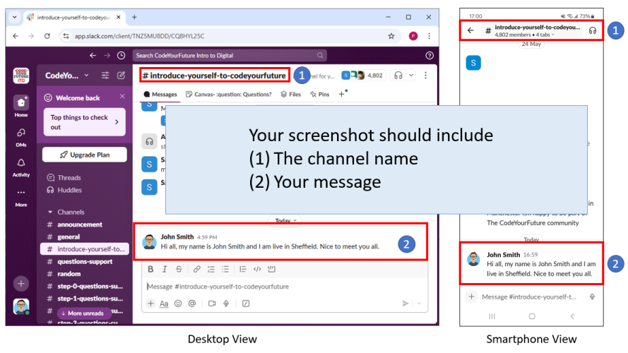

+++
title ="Step 0: What to do"
description= "Join the CodeYourFuture Intro To Digital Slack"
time= 60
[build]
  render = 'never'
  list = 'local'
  publishResources = false 
+++

### Overview

The CodeYourFuture Intro to Digital Slack (ITD Slack) is an environment where you can ask for help and build your local community.

### What Should You Do?

##### 1. Join the ITD Slack

To join the ITD Slack, click the **invitation link** in Step 0 on the [CYF Course Platform](https://application-process.codeyourfuture.io/).

> [!NOTE]
> Read the [Slack tutorial](https://slack.com/intl/en-gb/help/articles/360059928654-How-to-use-Slack--your-quick-start-guide) to get started on Slack.

##### 2. Update your Slack profile

Please use a consistent, professional name on Slack and add a consistent profile picture. We ask this so we can recognise each other. You don't have to share any information you are not comfortable with.


`How to update Slack profile`


##### 3. Introduce yourself on Slack

Visit the [`#introduce-yourself-to-codeyourfuture`](https://cyf-introtodigital.slack.com/archives/CQ8HYL25C) channel and post a message introducing yourself.

##### 4. Take a screenshot of your introduction

Your screenshot should show the channel name and your message.

Here are sample screenshots taken on a desktop and a smartphone.

##### 5. Submit your screenshot 

Upload your screenshot in Step 0 on the [CYF Course Platform](https://application-process.codeyourfuture.io/).
