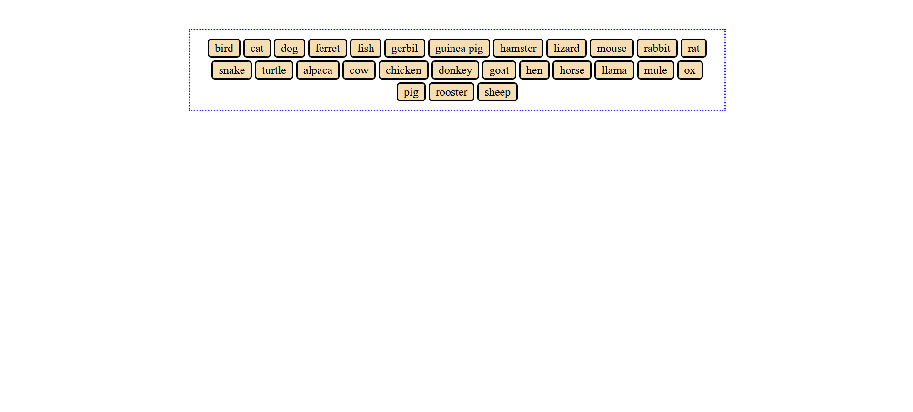
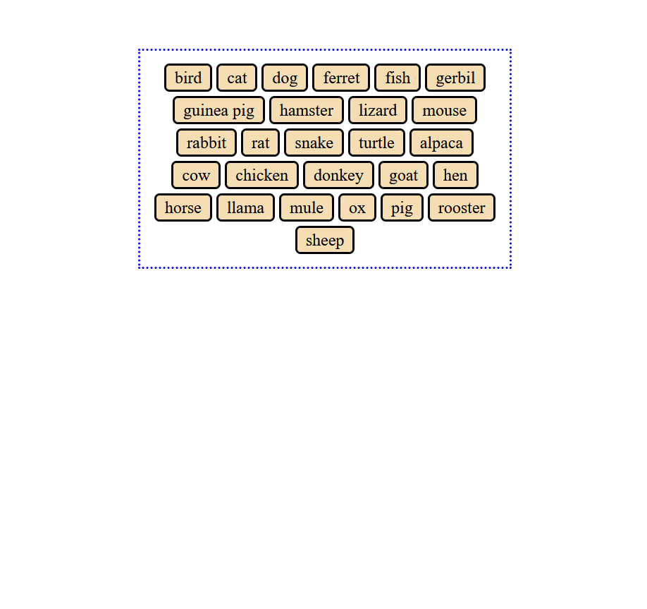

+++
title ="Step 7: What to do"
description= "Use the internet appropriately to solve a novel CSS problem"
time= 90
[build]
  render = 'never'
  list = 'local'
  publishResources = false 
+++

### Overview

In this task we're going to build a small page using HTML and CSS, two techniques we don't know yet. We're intentionally building with something we haven't learnt yet so you can explore how to look for information using the internet.

This step is an opportunity to practice this with a practical task which is outside your current knowledge of CSS and HTML. We have provided a **[CodePen](https://codepen.io/Ara225/pen/JoYbRVd)** which contains some HTML code. Your task is to use CSS to style the HTML so that:

- The element with the class of "parent" has a dotted border.
- The element with the class of "parent" is centred on the page even if the screen size changes.
- The div elements with the class "child" have background colors, borders, rounded corners and margins between them.
- The div elements with the class "child" stay inside the element with the class "parent" even if the screen size changes.
- The div elements with the class "child" are centred within the element with the class "parent".

You must not change the HTML in anyway.

You may use any colours you like - they aren't the important bit in this task.

Here are some visual examples:

#### On a large screen

#### On a much smaller screen

Assuming you were new to HTML and CSS when you started this course, this task is outside your current knowledge. This makes it an excellent candidate for internet or AI assistance, as you can use these tools to help you understand the new concepts.

_(You can also give it a go without these tools if you feel up for it 👀)_

### What Should You Do?

**You are not allowed to generate code using AI. You must write your own code.**

#### 1. Fork the CodePen

Fork the **[exercise CodePen](https://codepen.io/Ara225/pen/JoYbRVd)** into the CodePen account you created in step 5.

#### 2. Make a Plan

Start by thinking about what you need to know to solve this problem.

What might be a good first question to search for? What steps might be needed to reach the end result? What knowledge do you lack and need to find out?

#### 3. Search for answers

Use the internet or an AI tool (or both) to help you solve the problem. It must not involve copying code or blindly following AI output without understanding why.

Revisit [step three](https://curriculum.codeyourfuture.io/itd/steps/three/) for more advice on how to use AI tools. If you're stuck, Google or ask in the #step-7-questions-support channel on Slack.

#### 4. Self Check

Look over the code you have written.

1. Do you understand it all? Can you explain it out loud? What do you not understand?
1. Has any code been pasted from the internet or AI?
1. What worked or didn't work when searching the internet or prompting AI?

#### 5. Create a Google Doc

Create a Google Doc.

> [!NOTE]
> If you are new to Google Docs, you may find this [guide on what Google Docs is and how to use it](https://support.google.com/docs/answer/7068618?hl=en-GB&co=GENIE.Platform%3DDesktop) useful.

#### 6. Put your name in the document name

Include your given name or your family name in the title of the Google Doc.


`How to change document name in Google Docs`


#### 7. Make your Google Doc public

Change the sharing settings of your Google Doc to "Anyone with the link can view".


`How to share Google Docs to public`


#### 8. Fill out your Doc

Please add the following to your google doc:

- A link to your CodePen (please note that volunteers probably won't give you a full code review but this is useful context for them)
- A screenshot of the output in CodePen
- Your answers to the questions in the '4. Self Check' section above

#### 9. Submit the Google Doc link

Submit the link to the Google Doc in Step 7 on the [CYF Course Platform](https://application-process.codeyourfuture.io/).
