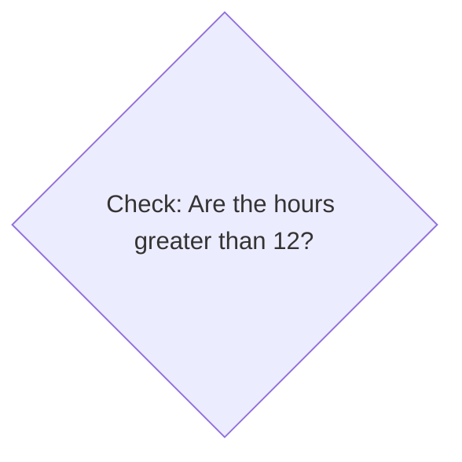
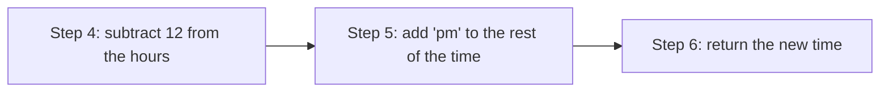

+++
title = 'Assembling the parts'

time = 20
[objectives]
    1='Explain how different concepts are combined to solve a goal'
[build]
  render = 'never'
  list = 'local'
  publishResources = false

+++

Earlier we defined a sub-goal to find a value for the hours from the `time` input. We've found that `Number(time.slice(0,2))` is an expression that evaluates to the hours from `time`. So we can write an `if` statement using this expression:

```js
if (Number(time.slice(0, 2)) > 12) {
}
```

If the time is `"23:00"` then the expression `Number(time.slice(0, 2)) > 12` will evaluate to `true` and the body of the `if` statement will be executed.

This `if` statement is implementing the following part of the diagram from earlier:



Now we can format the string using our approach from earlier:
we’ll need to append `"pm"` to the string expression and subtract 12 from the hours. So we get the following:

```js
if (Number(time.slice(0, 2)) > 12) {
  return `${time.slice(0, 2) - 12}:00 pm`;
}
```

The `return` statement above implements the following steps we set out earlier:



Now we can **re-run** our assertions from earlier to check our function behaves as target.
