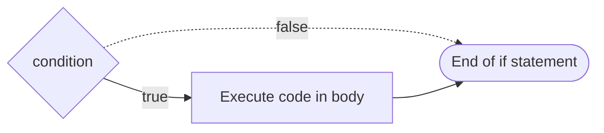

+++
title = 'Conditionally executing code'

time = 30
[objectives]
  1='Construct a flow diagram that describes how to produce an output from a given input'
  2='Explain when it is necessary to use a conditional statement'
  3='Identify the syntactic features of an if statement'
  4='Analyse a conditional statement to determine whether or not the statement will be executed'
  5='Determine the output of a program that uses a conditional statement'
[build]
  render = 'never'
  list = 'local'
  publishResources = false

+++

> Recall: JavaScript programs are built up from sequences of **declarations** and **statements**.

In programming, we can use an **`if` statement** to execute some code when a given condition is `true`. In JavaScript, we can write an `if` statement as follows:

```js {title="main.js"}
if (condition) {
  // do some code in here
}
```

The `if` statement consists of:

1. `if` keyword: this is the start of the `if` statement
2. `condition`: condition is an expression that evaluates to true or false. The condition must be in a pair of parentheses: `()`
3. `{}`: a block statement: any code we want to execute if the condition is true goes inside the curly braces here

We can represent this with a diagram too:




===[[Exercise 1]]===

### 🕹️ Playing computer

```js
function checkDivisibility(a, b) {
  if (a % b === 0) {
    return `${a} is divisible by ${b}`;
  }

  return `${a} is not divisible by ${b}`;
}

console.log(checkDivisibility(10, 2));
console.log(checkDivisibility(50, 3));
```

Play computer with the example above, step through each line in the code and work out happens each time the function is called.

- What is the **return value** each time the function is called?
- What value is assigned to the **parameters** `a` and `b` each time the function is called?

If you've not encountered any syntax before, remember to look it up in some documentation.

===[[Exercise 2]]===

### 🕹️ Playing computer

```js
function getCountryCode(phoneNumber) {
  if (phoneNumber.startsWith("+44")) {
    return "UK";
  }
}

getCountryCode("+447831620328");
getCountryCode("+989871783972");
```

Play computer with the example above, step through each line in the code and work out happens each time the function is called.

- What is the **return value** each time the function is called?
- What value is assigned to the `phoneNumber` parameter each time the function is called?
- Try describing the purpose of this function - what should it do?


