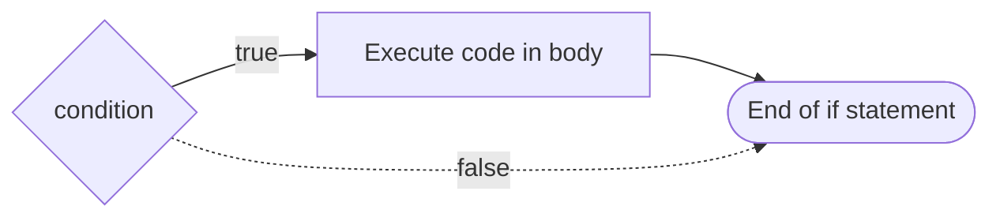

+++
title = 'Conditionally executing code'

time = 30
[objectives]
  1='Construct a flow diagram that describes how to produce an output from a given input'
  2='Explain when it is necessary to use a conditional statement'
  3='Identify the syntactic features of an if statement'
  4='Analyse a conditional statement to determine whether or not the statement will be executed'
  5='Determine the output of a program that uses a conditional statement'
[build]
  render = 'never'
  list = 'local'
  publishResources = false

+++

In programming we can use an **`if` statement** to execute some code when a given condition is `true`. In JavaScript, we can write an `if` statement as follows:

```js
if (condition) {
  // code to execute if condition is true
}
```

The `if` statement consists of:

1. `if` keyword - this is the start of the `if` statement
2. `condition` - condition is an expression that evaluates to true or false. The condition must be in parentheses: `()`
3. `{}` - a code block: any code we want to execute if the condition is true goes inside these braces

We can represent this with a diagram too:


```mermaid

flowchart LR
    IC{condition}
    IB[Execute code in body]
    EXIT([End of if statement])
    IC --> |true| IB
    IB --> EXIT
    IC -.-> |false| EXIT
```

### Writing an `if` statement

We're going to write some code to implement our password checker example. We'll use `console.log` to print messages for the user which will change depending on the password they enter. Let's start by creating a file called `passwordChecker.js` to work in and initialising some variables.

```js {title="passwordChecker.js"}
const password = "secretword123";
const userInput = "secretword123";
```

We'll assume for now that the user has entered the correct password and we're storing that value in `userInput`. The `password` variable contains the value that we want to compare it to. Let's add an `if` statement and compare the two variables as our `condition`.

```js {title="passwordChecker.js"}
const password = "secretword123";
const userInput = "secretword123";

if (userInput === password){
  // code will go here
}
```

Remember to use strict equality!

The next step is to define what should happen **if the condition is met**. A real password checker would start the process of loading a user's profile, but in our example we'll print a message confirming that the values match.

```js {title="passwordChecker.js"}
const password = "secretword123";
const userInput = "secretword123";

if (userInput === password){
  console.log("Correct password entered");
}
```

### What happens if the condition is `false`?

Our code is great at letting the user know they entered the correct password, but they might make a mistake one time. Try changing the value of `userInput` and see what happens when it doesn't match `password`.

That wasn't very helpful, was it? We'll look at how we handle things going wrong in more detail in the next few sections but for know we know we _definitely_ don't want things to fail without telling us anything. We need to tell our program what to do if the values don't match.

To do this we will use the `else` keyword. When we add an `else` block to an `if` statement we're saying "if the condition is false do this instead". 

```js {title="passwordChecker.js"}
const password = "secretword123";
const userInput = "thisiswrong";

if (userInput === password){
  console.log("Correct password entered");
} else {
  console.log("Incorrect password!");
}
```

Try running your code again - you should now see "Incorrect password!" printed in the terminal.

Try changing `userInput` again so it matches `password` and see what happens now. Note that you will never see both messages printed. If the condition is `true` then the block after it is executed and the program moves on.

### More than two possibilities

We won't always be dealing with yes/no questions. Sometimes we need to consider additional options. Let's imagine we have a secret password administrators can use to access anyone's account.

```js {title="passwordChecker.js"}
const password = "secretword123";
const userInput = "thisiswrong";
const adminPassword = "override";

if (userInput === password){
  console.log("Correct password entered");
} else {
  console.log("Incorrect password!");
}
```

Our code doesn't specify what should happen if the user enters this admin password. We can change that by adding an `else if` block after the original condition but before the `else` block. This is structured the same way as the initial condition.

```js {title="passwordChecker.js"}
const password = "secretword123";
const userInput = "thisiswrong";
const adminPassword = "override";

if (userInput === password){
  console.log("Correct password entered");
} else if (userInput === adminPassword){
  console.log("Admin access granted");
} else {
  console.log("Incorrect password!");
}
```

We will still only ever see one block being executed, but now our program can handle more than two possibilities. The order of these conditions matters. If `userInput === password` the first block will be executed and the program will move on; we will only check `userInput === adminPassword` if that initial condition is `false`, and we will only execute the code following `else` if _both_ conditions are `false`.