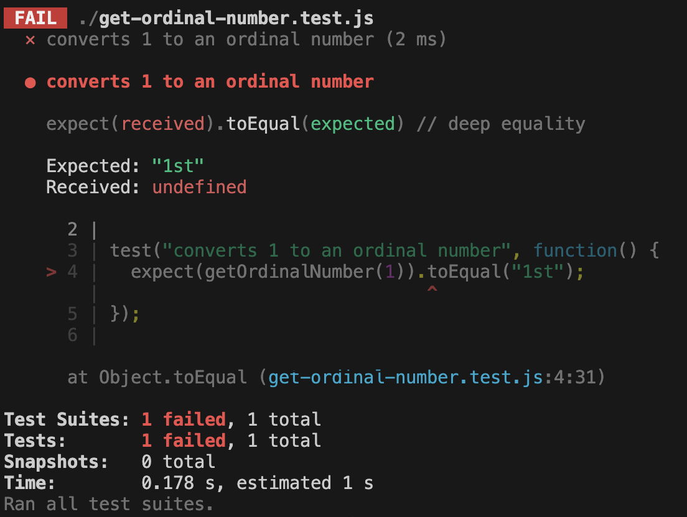

+++
title = 'Interpreting feedback'

time = 25
[objectives]
    1='Identify current output and target output in test feedback'
    2='Determine the line an error occurred from some test feedback'
    3='Give an example of why Jest makes tests easier to write than console.assert'
[build]
  render = 'never'
  list = 'local'
  publishResources = false

+++

We currently have a project structure like this:

```raw
week-4-test-example
├── get-ordinal-number.test.js
├── package.json
├── package-lock.json
└── node_modules

1 directory, 3 files
```

And `get-ordinal-number.test.js`
looks like this

```js
test("converts 1 to an ordinal number", function () {
  expect(getOrdinalNumber(1)).toEqual("1st");
});
```

After running the test above, we should get feedback indicating whether or not the test has passed.


Predict and explain what the test feedback will be when the test above is executed.


### 🚢 Defining the function

At the moment, our test feedback gives the following:


Just like we saw when the `test` function wasn't defined, the test code is throwing a A **ReferenceError** occurs when we try to reference a variable that we've not defined in our code.

This means that we haven't defined a function named `getOrdinalNumber`, but we're trying to use it.

To fix this, we can declare `getOrdinalNumber`.

```js
function getOrdinalNumber() {}

test("converts 1 to an ordinal number", function () {
  expect(getOrdinalNumber(1)).toEqual("1st");
});
```

Now we can run the tests again and check the test feedback.

### Assertion errors

We now get the following feedback:



Jest tells us 3 main things:

1. The test case that failed
2. The target output and the current output
3. The line number where error occurred

Jest defines **Expected** and **Received** in the test feedback:

- Expected: "1st"
- Received: `undefined`



What are the values of **Expected** and **Received** in the test output?

How do **Received** and **Expected** match up with the target output and expected output ?

What line number did the test case fail on?



### Avoiding repetition

When we wrote `console.assert` tests before, we ended up extracting variables because we were re-using values.

Without Jest, this assertion would probably have looked more like:

```js
const input = 1;
const targetOutput = "1st";
const currentOutput = getOrdinalNumber(input);
console.assert(
  targetOutput === currentOutput,
  `Expected ${targetOutput} but got ${currentOutput}`
);
```

Because Jest makes a useful error message for us telling us what the target and current outputs are, we could write this all in one line. We didn't need a variable so we could pass `"1st"` both to `getOrdinalNumber` and into the message.

Jest helped us to avoid writing more repetitive code.

### Passing `getOrdinalNumber`

We can now pass the test by implementing functionality for the first test case.
We could write the following:

`get-ordinal-number.test.js`:

```js {linenos=table,hl_lines=["2"],linenostart=1}
function getOrdinalNumber() {
  return "1st";
}

test("converts 1 to an ordinal number", function () {
  expect(getOrdinalNumber(1)).toEqual("1st");
});
```
