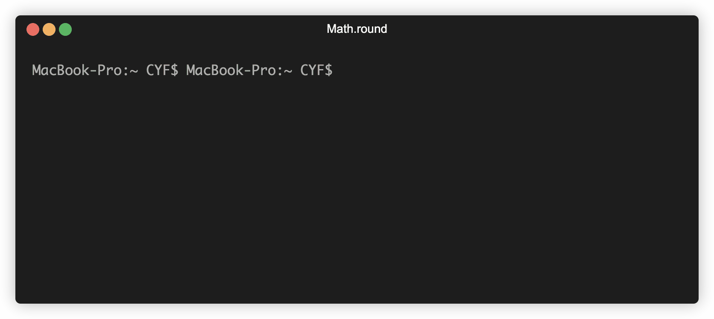

+++
title = 'Functions'

time = 20
[objectives]
    1='Define a function in programming'
    2='Evaluate a function expression'
    3='Call a function with an input in REPL'
[build]
  render = 'never'
  list = 'local'
  publishResources = false

+++

Now, instead of adding or multiplying numbers, we’ll consider `10.3`.

> 🤔 "What is the nearest whole number to `10.3`?"

The process of finding the nearest whole number to a decimal number is called **rounding**. So we could rephrase our question as:

> 🤔 "What does the number `10.3` **round** to?”

## ♻️ Reusing instructions

There is no operator for rounding the number `10.3` in JavaScript. But we will want to round numbers **again and again**. We should use a A **function** is a reusable set of instructions..

`Math.round` is a function. Because a function is a _reusable_ set of instructions, `Math.round` rounds any number.

Functions usually take **inputs** and then **apply their set of instructions to the inputs** to produce an **output**.


===[[Try it yourself]]===

1. Write `Math.round` in the Node REPL
1. Hit enter to evaluate our expression

The REPL output `[Function: round]` is telling us `Math.round` is a function.

===[[Watch and follow along]]===




## 📲 Calling a function

For our function to work, we need Node to read the instructions and Execution means the computer reads and follows instructions. them. Write the following in the REPL:

```js
Math.round(10.3);
```

Notice the `(` and `)` brackets after the name of the function and a number inside the brackets. These brackets mean we are calling the function. The number inside the brackets is the **input** we're passing to the function.



**Calling a function** means telling the computer to read the function's instructions and carry out its instructions. When calling a function we can also pass inputs to the function.



`Math.round(10.3)` is a call expression; read this as:

"apply the set of instructions for `Math.round` to the number `10.3`."

If we type `Math.round(10.3)` then we get the result `10`. So we say that `Math.round(10.3)` _returns_ `10`.

A **call expression** is an **expression** which **evaluates** to the value returned by the function when it is called. So the expression `Math.round(10.3)` evaluates to the value `10`.

If we assign that expression to a variable, or use it in a string, we'll get the value `10`. So we can write:

```js
const roundedValue = Math.round(10.3);
```

or we can write:

```js
const roundedValueInAString = `10.3 rounds to ${Math.round(10.3)}`;
```

Both of these instructions **evaluate** the call expression `Math.round(10.3)` to the returned value `10` as soon as the call expression appears. The variable `roundedValue` will have a numeric value `10` (just like if we'd written `const roundedValue = 10;`), and the variable `roundedValueInAString` will have a string value `"10.3 rounds to 10"`.
