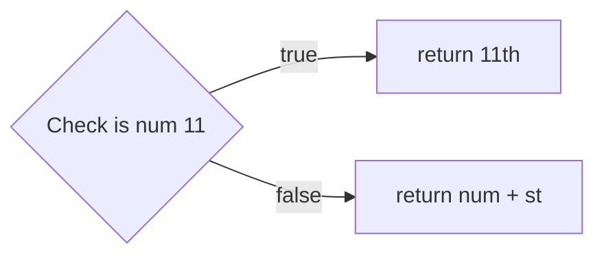
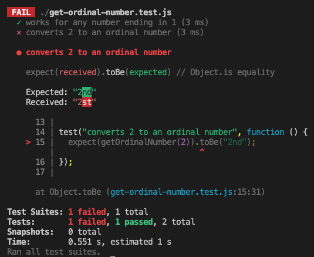

+++
title = 'Generalising further'

time = 30
[objectives]
    1='Define an outlier'
[build]
  render = 'never'
  list = 'local'
  publishResources = false

+++

### 🧰 Handling outliers

We can now implement functionality for `getOrdinalNumber`.

Our strategy might be something like this:



Most of the time we just need to return the number with "st" on the end.

However, 11 is an outlier: it doesn't conform to this pattern.

So our current strategy for this test case will be to check if the number is 11 first and do something differently ( return `"11th"` ): otherwise we return the default value of num with `"st"` on the end.

Here's the implementation:

```js {linenos=table,hl_lines=["1-5"],linenostart=1}
function getOrdinalNumber(num) {
  if (num === 11) {
    return "11th";
  }
  return `${num}st`;
}

test("works for any number ending in 1", function () {
  expect(getOrdinalNumber(1)).toEqual("1st");
  expect(getOrdinalNumber(11)).toEqual("11th");
  expect(getOrdinalNumber(21)).toEqual("21st");
});
```

###  🧭 Future strategies

Now, we've handled any numerical inputs ending in 1. We can try to build up functionality for _any_ number ending in 2.

We can start by adding a test case that only asserts something about the input of 2.

We cannot add this assertion to the first test case. The first test case checks for inputs that end in a 1.
To check the case when the input ends in 2, we need to introduce a new test case.

```js {linenos=table,hl_lines=["14-16"],linenostart=1}
function getOrdinalNumber(num) {
  if (num === 11) {
    return "11th";
  }
  return `${num}st`;
}

test("works for any number ending in 1", function () {
  expect(getOrdinalNumber(1)).toEqual("1st");
  expect(getOrdinalNumber(11)).toEqual("11th");
  expect(getOrdinalNumber(21)).toEqual("21st");
});

test("converts 2 to an ordinal number", function () {
  expect(getOrdinalNumber(2)).toEqual("2nd");
});
```



===[[exercise 1]]===

### Check the test output

Here's the test feedback for the test above:


**Play computer** with `getOrdinalNumber` when it is called with an input of 2
Double check you agree with the test feedback in this case.

Before coding, outline a strategy for handling the second test case.

===[[exercise 2]]===



Try updating the second test case to check `getOrdinalNumber` works for other numerical inputs ending in 2.




We know that this doesn't solve all cases (e.g. it will give the wrong answer for getOrdinalNumber(2)), but it's a start, and we have a test-case showing that it works in one case.

This points out a limitation of tests. They only test the cases we wrote tests for. Right now, all our tests are passing, but we know our solution doesn't work for all inputs!

In order to generalise our solution (to make it work "in general" rather than just for one specific case), It's important to think about what different groups of inputs we may expect.
