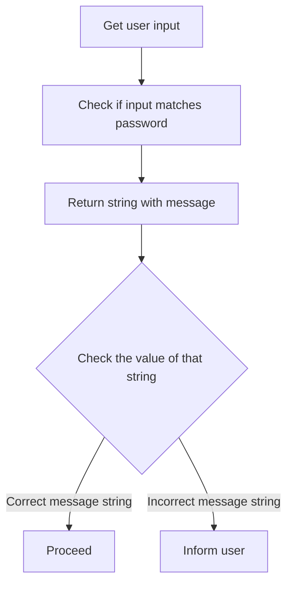

+++
title = 'Refactoring'

time = 20
[objectives]
1='Define "refactoring"'
2='Modify code to change its structure without changing its functionality'
[build]
  render = 'never'
  list = 'local'
  publishResources = false

+++

Our `checkPassword` function is doing its job well but it's getting quite long. We also need to think about how it will interact with other parts of an application.

Returning a string is fine when we're printing an output to the console but it's actually not that useful if we want to do something else with it in code. If another function wanted to use the returned value the workflow would look like this:



We make two comparisons in a row: we ask if two strings match, which produces a string, then we check that string to see what it says. That's not very efficient. It would be much simpler if our password check gave a "yes" or "no" answer.

In programming we can use the boolean values `true` and `false` when asking yes/no questions like this. We can update `checkPassword` to return these values by **refactoring** it.

### Editing our code

When we refactor code we make changes to its structure without changing how it behaves. In this example we will go slightly beyond what a typical refactor would involved because we will be changing the return values too, but our function will still be doing the same job. Let's swap the strings for `true` and `false`.

```js {title="passwordCheckerFunction.js"}
const password = "secretword123";

function checkPassword(userInput){

  let response;

  if (userInput === password) {
    response = true;
  } else {
    response = false;
  }

  return response;
}
```

Calling this function with different arguments will now return either `true` if the argument matches the value stored in `password` or `false` if it doesn't. So far so good! By making `response` a boolean we have made our code easier to understand, but also made it less likely that we will make a mistake by trying to match a complex string.

We could go even further and reduce our function's length. Our if statement is evaluating an expression, and if it evaluates to `true` we are setting `response = true`. Likewise if the expression is `false`. Why not just store the result of the evaluation in `response`? That would get rid of three lines of code!

```js {title="passwordCheckerFunction.js"}
function checkPassword(userInput){

  const response = userInput === password;

  return response;
}
```


We have just made a fairly big change to our code so don't worry if it takes a moment to fully understand what has happened. You can check that everything still works by calling the function with different arguments and observing the output.


We have also switched to use `const` in the variable declaration since we don't need to reassign it any more. We can go even further, though. We declare the `response` variable then immediately return it without using it for anything else. Since we are done with it so quickly, why bother with the variable declaration at all? Why not go straight to returning the expression?

```js {title="passwordCheckerFunction.js"}
function checkPassword(userInput){

  return userInput === password;

}
```

Now it's even shorter. There is a trade-off here. We have made our function much shorter but this often happens at the expense of readability. Don't be tempted to refactor too far and make things difficult for anyone (including yourself) reading your code in the future.