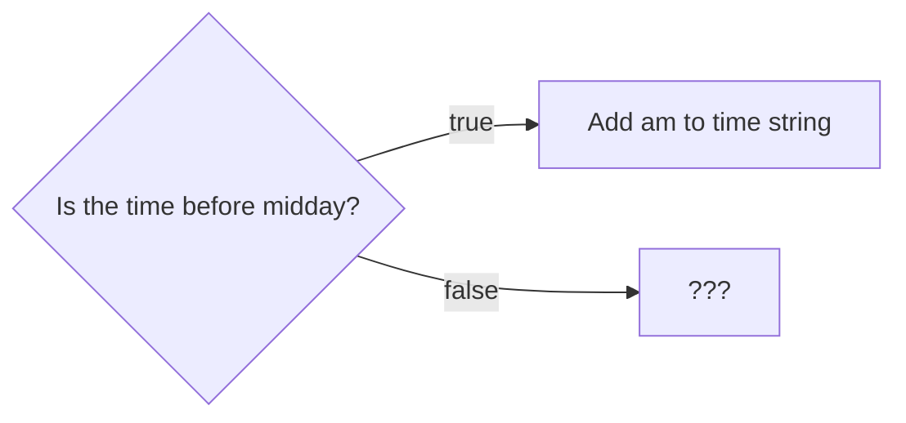

+++
title = 'Making a choice'

time = 10
hide_from_overview = true
[objectives]
    1='Propose a strategy for solving a problem'
    2='Identify sub-problems within a larger problem'
[build]
  render = 'never'
  list = 'local'
  publishResources = false

+++

Our function works for morning inputs like `"08:00"`. In this case, the function returns the target output of `"08:00 am"` as required. However, at the moment, the output of `formatAs12HourClock("23:00")` is `"23:00 am"`.

> 💡 We need to execute some different logic when the time is beyond midday

We can interpret this behaviour as a question:

We need to make two changes to our code.

1. We need to do something different depending on whether the time is before midday. This is called running code **conditionally**.
2. And then we need to know what we do if the time is after midday.

We don't need to solve the whole problem at once. First let's work out how to do something different depending on the time. We can worry about what we need to do differently once we've solved this problem.


It's easier to search for the solutions to smaller parts of problems than the whole problem.

Programming is all about breaking down problems into smaller pieces which we can solve.

