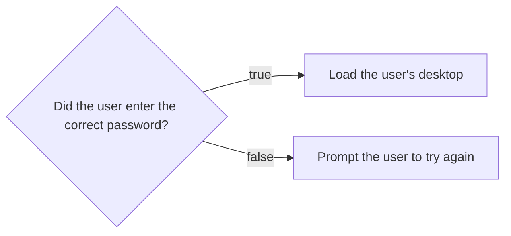

+++
title = 'Making a choice'

time = 10
hide_from_overview = true
[objectives]
    1='Propose a strategy for solving a problem'
    2='Identify sub-problems within a larger problem'
[build]
  render = 'never'
  list = 'local'
  publishResources = false

+++

Let's return to our password example from the previous section. Our code needs to be able to handle two possible scenarios:

- The user enters the correct password
- The user enters the wrong password

When we design our code we can interpret this as a question:

```mermaid

flowchart LR

A{Did the user enter the correct password?} -- true --> B[Load the user's desktop]
A -- false --> C[Prompt the user to try again]
```

We need to consider both possibilities when writing our code.

1. We should only load the desktop if the correct password is entered. This is called running code **conditionally**.
2. We need to know what to do if the incorrect password is entered.

We don't need to solve the whole problem at once. First let's work out how to do something different if the password is correct. We can worry about what we need to do differently once we've solved this problem.


It's easier to search for the solutions to smaller parts of problems than the whole problem.

Programming is all about breaking down problems into smaller pieces which we can solve.

