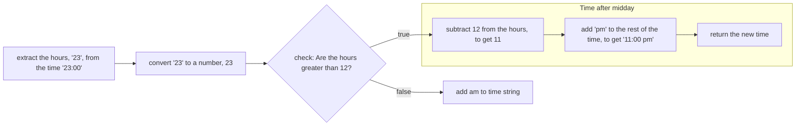
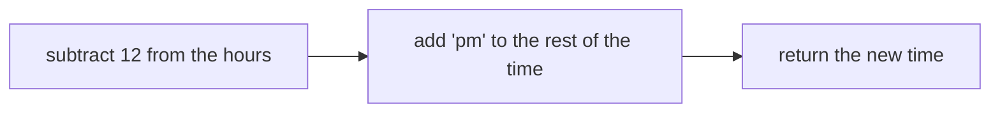

+++
title = 'Sub-goal #2'

time = 10
hide_from_overview = true
[objectives]
    1='Explain how different concepts are combined to solve a goal'
[build]
  render = 'never'
  list = 'local'
  publishResources = false

+++

Now we can think about what we do when we've identified a time is after midday.

Earlier, we observed what to do when the time goes beyond midday: **subtract 12 from the hours time to get the new hours for the 12 hour clock time**.

_Before_ writing code, we can define our approach in steps:

Starting with an input like `"23:00"`:



Now we can format the string using our approach from earlier:
we’ll need to append `"pm"` to the string expression and subtract 12 from the hours. So we get the following:

```js
if (Number(time.slice(0, 2)) > 12) {
  return `${Number(time.slice(0, 2)) - 12}:00 pm`;
}
```

The `return` statement above implements the following steps we set out earlier:



Now we can **re-run** our assertions from earlier to check our function behaves as target.
