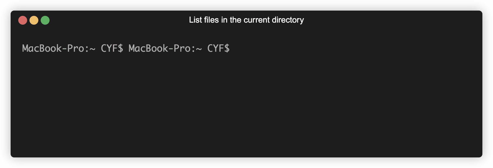

+++
title = 'Terminal interface'

time = 10
[objectives]
1='Identify the terminal and its purpose'
2='Execute commands in the terminal'
[build]
  render = 'never'
  list = 'local'
  publishResources = false

+++

Programmers need interfaces to ask computers to do things. A computer terminal is an **interface** where programmers can issue commands to a computer. Because users enter text instructions and receive text output, we say that the terminal is a **text-based interface**.

### Open Your Terminal

#### Interface via the terminal

We can input a command into the prompt and hit enter. The terminal then passes this command to the computer to execute. Find your own terminal and input the `ls` command:

```
ls
```

#### The terminal on Mac



### 🖊️ Writing computer instructions

We can issue commands to the computer using the terminal. These commands are instructions that the computer knows how to interpret.

The computer knows `ls` means **"list the files and directories in the current directory"**.

During the execution of a computer program, a computer will store and modify Data is information. Text, images, numbers are all _forms_ of data. The data in an executing program is sometimes called the **state**. A computer program will modify data with  Operations modify or create data, from the current data in the program. Adding numbers, joining words, changing text to ALLCAPS, are all operations.


`ls` is a shell command. Shell is a programming language we use to interact with the files and folders on our computer. You already know at least two more programming languages. Can you name them?



A **programming language** is a limited set of rules for writing computer instructions.


