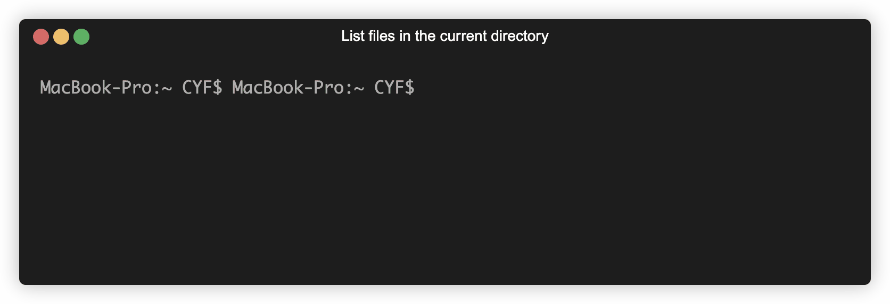
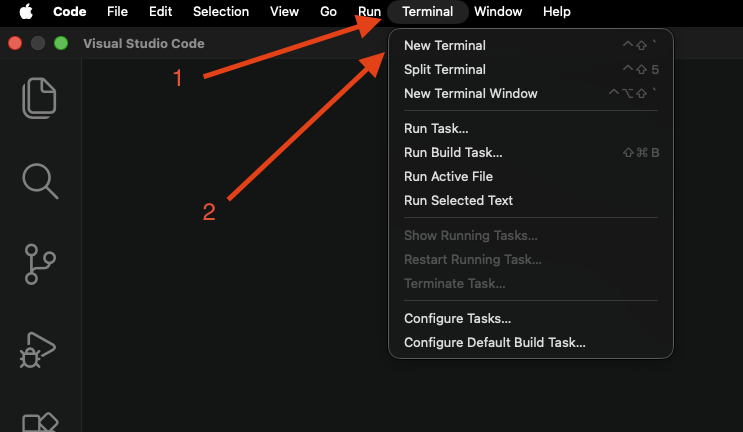

+++
title = 'Terminal interface'

time = 10
[objectives]
1='Identify the terminal and its purpose'
2='Execute commands in the terminal'
[build]
  render = 'never'
  list = 'local'
  publishResources = false

+++

Programmers need interfaces to ask computers to do things. A computer terminal is an **interface** where programmers can issue commands to a computer. Because users enter text instructions and receive text output, we say that the terminal is a **text-based interface**. It is also often referred to as the **command line**.

### Opening the Terminal

#### The Terminal Application

Every computer has a built-in application which we can use as a terminal. On Mac and Linux this app is conveniently called "Terminal"!

When you open the terminal you will see a blank screen with a cursor waiting for input. You can type instructions here and the computer will carry them out. Some instructions are quite simple, others can be quite complex. Anything you can do in an application like Explorer can be done here by typing a command, and you can often do it much quicker in the terminal! The example below shows a user listing the contents of a directory.

#### The Terminal in VSCode

We can also open a terminal within VSCode, meaning we don't need to switch between applications while we work. This is really useful when we need to refer back to the results of previous commands, such as logging output or test results. Anything we can do in the terminal app can be done within VSCode.

You can open a terminal in VSCode by clicking `Terminal -> New Terminal`.

### Writing Commands

We can issue commands to the computer using the terminal. These commands are instructions that the computer knows how to interpret. As we go through the course we will introduce some commands which need particular tools to work, but for now we will focus on exploring our file system.

One of the most useful commands is `pwd`, for **print working directory**. This will tell you where you are in your file system, like pulling out a map with a big "you are here" sign on it.

The `ls` command means **"list the files and directories in the current directory"**.

To move from one directory to another we can use the `cd` (**change directory**) command. This is an example of a command which needs some extra information - we need to tell it where we want to go! For example, we would navigate to our `Downloads` folder using `cd Downloads`.



The commands we use are **case-sensitive**, which means we need to take care with capital letters. As far as the computer is concerned a folder called `downloads` and another called `Downloads` have totally different names! This is a really common cause of bugs, so if something doesn't work the way you expect you should always check your spelling!



We can make our own new directories using the `mkdir` command. When we use this command we need to provide a name for our new directory, eg. `mkdir my_stuff`.

We create new files using `touch`, and just like with directories we need to provide a name. An important part of creating a file is providing a **file extension**. This tells the computer what kind of file we have created, for example `document.txt` will be a text file and `picture.png` will be an image. You can create any kind of file using the terminal.



Coming up with names for things is one of the most challenging aspects of programming. In general a good name will make it obvious what a file contains without being too long, although there will be occasions where a file needs to have a specific name in order for something to work.

- ✅ `shopping_list.txt`
- ❌ `things_i_need_to_by_in_tesco_this_weekend_version_2.txt`
- ❌ `stuff.txt`





Visit [Terminal Temple](https://www.terminaltemple.com/) and try to complete the following tasks. Don't worry if something goes wrong, you can reset by pasting `resetterm --force` into the interface and pressing enter.

1. Move into the `Documents` folder.
2. Create a new directory called `study-plans`.
3. Move into your new directory.
4. Create two new files: `week1.txt` and `week2.txt`.
5. Move back to the `Documents` directory - this will need some further research!
6. Delete `empty-file.txt`. This will also need some research!
7. Check that the file was deleted by listing the contents of the directory.


