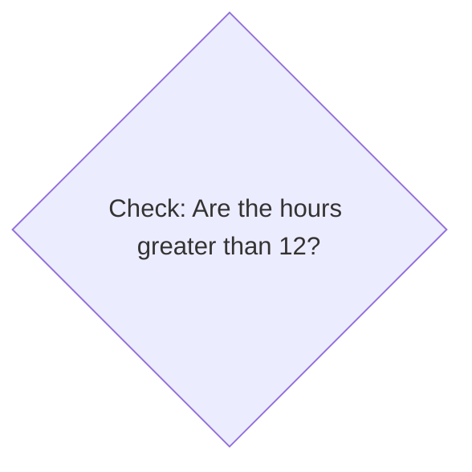

+++
title = 'Testing a sub-goal'

time = 15
hide_from_overview = true
[objectives]
    1='Test a solution to a sub-goal before solving the whole problem'
[build]
  render = 'never'
  list = 'local'
  publishResources = false

+++

Earlier we defined a sub-goal to find a value for the hours from the `time` input. We've found that `Number(time.slice(0,2))` is an expression that evaluates to the hours from `time`. So we can write an `if` statement using this expression:

```js
if (Number(time.slice(0, 2)) > 12) {
}
```

If the time is `"23:00"` then the expression `Number(time.slice(0, 2)) > 12` will evaluate to `true` and the body of the `if` statement will be executed.

This `if` statement is implementing the following part of the diagram from earlier:



Before we worry about how we handle times in the afternoon, we can check that we've solved this sub-goal.

We can check that we are correctly identifying times in the afternoon by adding in our `if` statement (which we think is correct), with a placeholder body:

```js {linenos=table,linenostart=1,hl_lines=["2-4"]}
function formatAs12HourClock(time) {
  if (Number(time.slice(0, 2)) > 12) {
    return "Don't know how to handle times in the afternoon yet";
  }
  return `${time} am`;
}

const currentOutput = formatAs12HourClock("08:00");
const targetOutput = "08:00 am";
console.assert(
  currentOutput === targetOutput,
  `current output: ${currentOutput}, target output: ${targetOutput}`
);

const currentOutput2 = formatAs12HourClock("23:00");
const targetOutput2 = "11:00 pm";
console.assert(
  currentOutput2 === targetOutput2,
  `current output: ${currentOutput2}, target output: ${targetOutput2}`
);
```

If we run our code, we expect the current output of the `23:00` test-case to have changed. It won't be correct - the assertion will still fail. But if it hasn't changed, we know our `if` statement is wrong.

```console
% node clock-example.js
Assertion failed: current output: Don't know how to handle times in the afternoon yet, target output: 11:00 pm
```

Even though we _know_ the code on line 3 is incorrect, this was a useful step. It allowed us to run our code more often, and check that we're on the right track.


Run your code as often as you can.

Make small changes and run your code.

Sometimes we write code we know we will delete because it lets us get feedback sooner.


Now we can focus on just one problem: how to handle times after midday (i.e. fixing line 3). We don't need to worry about both detecting the time _and_ handling it.

If the output of this assert still printed `"23:00 am"` we would have stopped here and debugged that. Again, we could focus on just one problem.
