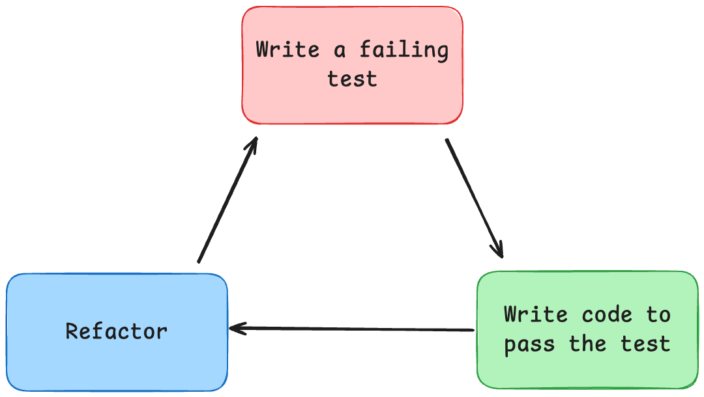

+++
title = 'Test-Driven Development'

time = 20
[objectives]
    1='Explain the benefits of test-driven development'
[build]
  render = 'never'
  list = 'local'
  publishResources = false

+++

So far we have been writing our tests after we have written our functions and using them to confirm that the functions do what they are supposed to do. The tests we write are still valid, but by taking this approach we risk [confirmation bias](https://thedecisionlab.com/biases/confirmation-bias) - we write the tests to prove something we already know to be true.

We can avoid this by writing the tests _before_ we write any code. This process is called **test-driven development** (**TDD**). We write tests which cover the desired behaviour of our function, then write the code to make those tests pass.

### How could TDD have helped last sprint?

Think back to the last sprint and how we built up the test suite for `convertTo12HourClock`:
- We wrote a test to ensure it worked for an afternoon time (`"23:00"`)
- We wrote a test to ensure it worked for a morning time and discovered a bug (`"08:00"`)
- We realised we forgot an edge case (`"00:00"`) and had to modify the function again.

After each step we thought we were done, but we weren't. We're still not finished now - we haven't written any tests to validate inputs, or checked early afternoon times. Because we were working in this file a lot while we learned about testing we found each of these issues quickly, but if we were working on a real-world project there could be a long time between "finishing" the code, discovering a missing test and fixing any bugs that arise. That's a lot of opportunities for something to go wrong.

Instead our workflow could have been:
- Write tests for afternoon time, morning time and the midnight edge case
- Write our first attempt at the function body
- See some tests pass and some fail
- Immediately fix bugs or add missing logic

We know what we need to do before we even start coding and we have the tools in place to identify problems before we declare ourselves finished. It doesn't guarantee that our code will be perfect, but it means many of the potential problems will be fixed before we declare ourselves "finished".

### Red-Green-Refactor

An important aspect of TDD is the need to verify that our code is what's making the test pass. That means ensuring that the test isn't passing by itself without us writing anything. If that happens we may have a poorly-defined test. 

Watching the tests fail first is part of the **red-green-refactor** cycle:

- Write a test
- Run the test file and watch the test fail
- Write enough code to make the test pass - **no more than necessary!**
- Run the test again and make sure it passes
- Refactor the code if necessary to improve readability or efficiency
- Run the test again to make sure it still passes
- Repeat with the next test

After modifying the function being tested we should always re-run _all_ of the tests, not just those for the feature we are writing. Making a change in one place can easily break something somewhere else.

It can be difficult to get into the TDD mindset, but once we do there are real benefits to it. In the next section we'll look at an in-depth example of the TDD workflow.