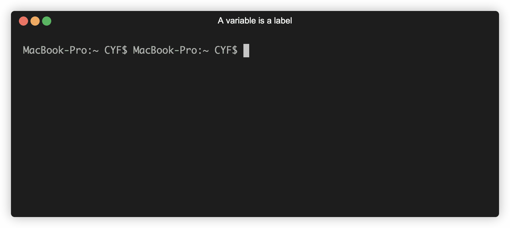

+++
title = 'Saving expressions'

time = 15
[objectives]
1='Identify the syntactic features of a variable declaration'
2='Explain why we use variable declarations'
3='Create strings using variables and template literals'
[build]
  render = 'never'
  list = 'local'
  publishResources = false

+++

In programming we often want to _reuse_ our work. Consider the string: `"Hello there"`

Suppose we want to create different greetings for different people, like: `"Hello there, Alicia"` `"Hello there, Barny"`

We can use a **variable** to store this string and reuse it. How can we create a A **variable** is a label for a piece of data. We assign a piece of data to a label and then refer back to this label, in place of the data.

We can create a variable in our program by writing a **variable** A _declaration_ is an instruction that binds an identifier to a value., like this:

```js title="variable declaration"
const greeting = "Hello there";
```

Break down the different syntactic elements of this variable declaration:

- `const` is a keyword used to indicate we're creating a variable.
- `greeting` is the **identifier** - it can be used to refer to a variable after it has been declared.
- `=` is the assignment operator. It means assign to the label `greeting` the value of the expression on the right hand side.
- `"Hello there"` - this is the expression whose value we're assigning to the label `greeting`.



===[[Try it yourself]]===
Type this variable declaration into the REPL:

```
const greeting = "Hello there";
```

Now refer to the label `greeting` in the REPL:

```
`${greeting}, Alicia`
```

Our `greeting` variable is stored in memory. We can reuse it to build more expressions:

```
`${greeting}, Barny`
```

===[[Watch and follow along]]===





We just used backticks to create a template literal.

```js
`A template literal places ${expressions} inside strings;
```

With template literals, we can insert expressions into strings to produce new strings. Any time we want to reference a variable inside a template literal we use a dollar sign `$` and a set of curly braces `{}`. We can put any expression (e.g. a variable name) inside the curly braces. The value that expression evaluates to is then placed inside the string.

When an operation uses an expression, that expression is immediately evaluated, and how it was written is forgotten about. That means that the `greetAlicia` variable is the same in all three of these cases:

```js
const greetAlicia = "Hello there, Alicia";
```


In this example, we don't use a variable or a template to create a string. Instead we write a string `"Hello there, Alicia"`.

A sequence of characters enclosed in quotation marks is called a **string literal**. `"Hello there, Alicia"` is a string literal.

Similarly, `10` is a **number literal**.

## 

```js
const name = "Alicia";
const greetAlicia = `Hello there, ${name}`;
```

```js
const greeting = "Hello there";
const name = "Alicia";
const greetAlicia = `${greeting}, ${name}`;
```

The `greetAlicia` variable doesn't remember whether you used variables to make it or not - in all three cases, `greetAlicia` contains the string `"Hello there, Alicia"`. Once a value is made, it doesn't matter _how_ it was made.
