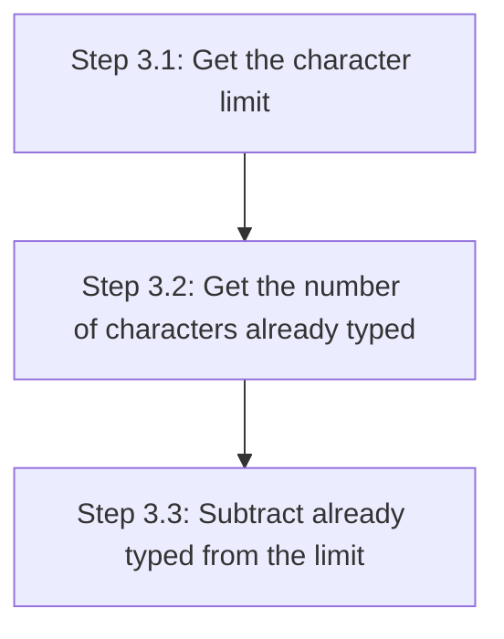

+++
title = 'Calculating the remaining characters'

time = 10
hide_from_overview = true
[objectives]
    1='Access properties representing HTML attributes'
[build]
  render = 'never'
  list = 'local'
  publishResources = false

+++

We want to implement Step 3: Calculate the number of characters left.

Let's break down Step 3 into sub-goals:



## Getting information from the DOM

We have seen that the DOM exposes live information about HTML elements in the page via properties on the objects it returns.

We wrote `textarea.value` to get the characters already typed. This solves Step 3.2 - we can write `textarea.value.length`.

We can also access the character limit, because it's defined as the `maxlength` attribute of the HTML textarea.

In the Dev Tools console, if you type `textarea.max` you should see autocomplete for a property called `maxLength`.

Most HTML attributes are exposed in the DOM as a property with the same name (but in camelCase). Let's try:

```js
console.log(textarea.maxLength);
```

Now that we have the character limit (from `textarea.maxLength`), and the number of characters already typed (from `textarea.value.length`):

```js
const remainingCharacters = textarea.maxLength - textarea.value.length;
console.log(remainingCharacters);
```

Try typing in your textarea, then running this in the Dev Tools console.
