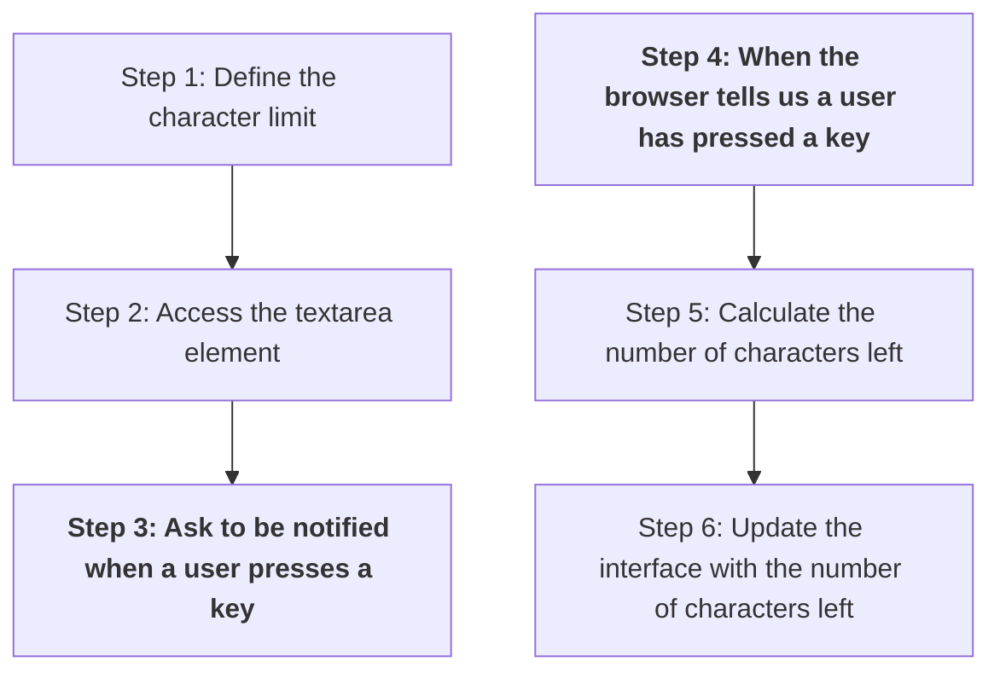

+++
title = '📈 Check progress'

time = 30
facilitation = false
emoji= '🧩'
[objectives]
    1='Use a plan to check progress in solving a problem'
[build]
  render = false
  list = 'never'
  publishResources = false

+++

Let's use the plan from earlier to check our progress.



Let's consider our code at the moment:

```js
const characterLimit = 200;
const textarea = document.querySelector("textarea");

function updateCharacterLimit() {
  console.log(
    "keyup event has fired... The browser called updateCharacterLimit..."
  );
}

textarea.addEventListener("keyup", updateCharacterLimit);
```

We've done the following:

- [x] Step 1: Defined a `characterLimit`
- [x] Step 2: Accessed the `textarea` element
- [x] Step 3: Registered an event handler `updateCharacterLimit`

The browser will do the following for us:

- [x] Step 4: The browser will tell us when a user has pressed a key

We must still complete the following steps:

- [ ] Step 5: Calculate the number of characters left
- [ ] Step 6: Update the user interface with the number of characters left

To obtain the characters left, we can calculate the difference between `characterLimit` and the number of characters in the `textarea` element:





```js
const characterLimit = 200;
const textarea = document.querySelector("textarea");

function updateCharacterLimit() {
  const charactersLeft = characterLimit - textarea.value.length;
  console.log(`You have ${charactersLeft} characters remaining`);
}

textarea.addEventListener("keyup", updateCharacterLimit);
```





```html
<section>
  <h1>Character limit</h1>
  <textarea id="comment-input" rows="5" maxlength="200"></textarea>
  <label for="comment-input"
    >Please enter a comment in fewer than 200 characters
  </label>
  <p id="character-limit-info">You have 200 characters remaining</p>
</section>
```





Typing in to the `textarea` element, we should see a string like `"You have 118 characters left"` printed to the console each time a key is released. However, we have one final step: we must now **update** the DOM label with the information about how many characters are left.
